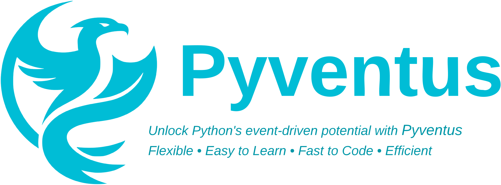

---
hide:
  - navigation
---

<style>
    .md-content .md-content__inner.md-typeset h1 { height: 0; margin: 0; color: transparent; }
    .md-content .md-content__inner.md-typeset::before { height: 0; } 

	.terminal-command {
		.go:before {
			content: "$";
			padding-right: 1.17647em;
		}
	}
</style>


<br>


<p align="center">
   
</p>

<br>

<p align="center">

<a href="https://github.com/mdapena/pyventus/actions?query=workflow%3ATests+event%3Apush+branch%3Amaster" target="_blank">
    
</a>

<a href="https://github.com/mdapena/pyventus/actions?query=workflow%3ADocs+event%3Apush+branch%3Amaster" target="_blank">
    
</a>

<a href='https://coveralls.io/github/mdapena/pyventus?branch=master'>
	
</a>

<a href="https://pypi.org/project/pyventus" target="_blank">
    
</a>

<a href="https://pypi.org/project/pyventus" target="_blank">
    
</a>

<a href="https://github.com/psf/black">
	
</a>

</p>


---

**Documentation**: <a href="https://mdapena.github.io/pyventus" target="_blank">https://mdapena.github.io/pyventus</a>

**Source Code**: <a href="https://github.com/mdapena/pyventus" target="_blank">https://github.com/mdapena/pyventus</a>

---

<p style='text-align: justify;' markdown>
    &emsp;&emsp;Pyventus is a powerful Python package for event-driven programming. It offers a comprehensive suite
	of tools to easily define, emit, and orchestrate events. With Pyventus, you can build scalable, extensible, and
	loosely-coupled event-driven applications.
</p>

[//]: # (--------------------------------------------------------------------------------------------------------------)

## Key Features

<p style='text-align: justify;' markdown>
    Pyventus offers several key features, such as:
</p>

<ul style='text-align: justify;'>

<li><b>Sync and Async Support</b> ─ 
Whether your code is synchronous or asynchronous, Pyventus allows you to define event handlers as either sync or async
callbacks and emit events from both scopes. 
</li>

<li><b>Customization</b> ─ 
Whether you choose official emitters or custom ones, Pyventus allows you to customize the behavior and capabilities of
the event emitters to perfectly align with your unique requirements.
</li>

<li><b>An Intuitive API</b> ─ 
Pyventus provides a user-friendly API for defining events, emitters, and handlers. Its design simplifies the process
of working with events, enabling you to organize your code around discrete events and their associated actions.
</li>

<li><b>Runtime Flexibility</b> ─ 
Pyventus' runtime flexibility allows you to switch seamlessly between different built-in or custom event emitter
implementations on the fly, providing a dynamic and adaptable environment for event-driven programming.
</li>

<li><b>Reliable Event Handling</b> ─ 
Pyventus allows you to define handlers to customize how events are processed upon completion. Attach success and
failure logic to take targeted actions based on the outcome of each event execution. 
</li>

<li><b>Scalability and Maintainability</b> ─ 
By adopting an event-driven approach with Pyventus, you can create scalable and maintainable code thanks to the loose
coupling between its components that enables extensibility and modularity.
</li>

<li><b>Comprehensive Documentation</b> ─ 
Pyventus provides a comprehensive documentation suite that includes API references, usage examples, and tutorials to
effectively leverage all the features and capabilities of the package.
</li>

</ul>

[//]: # (--------------------------------------------------------------------------------------------------------------)

## Quick Start

<p style='text-align: justify;'>
	&emsp;&emsp;Pyventus is available on <a href="https://pypi.org/project/pyventus/" target="_blank"><i>PyPI</i></a> and can
	be easily installed using <code>pip</code>. Note that, for proper dependency isolation, it is recommended to use a
	<a href="https://realpython.com/python-virtual-environments-a-primer/" target="_blank">virtual environment</a>.
	To install Pyventus, open a terminal and run the following command:
</p>

<div class="terminal-command">
```console
pip install pyventus
```
</div>

<p style='text-align: justify;'>
	&emsp;&emsp;Pyventus by default relies on the Python standard library and <b>requires Python 3.10+</b> with no 
	additional dependencies. However, this package also includes alternative integrations to access additional features 
	such as Redis Queue, Celery, and FastAPI support. For more information on this matter, please refer to the 
	<a href="https://mdapena.github.io/pyventus/getting-started/#optional-dependencies" target="_blank">Optional Dependencies</a>
	section.
</p>

[//]: # (--------------------------------------------------------------------------------------------------------------)

## A Simple Example

<p style='text-align: justify;'>
    &emsp;&emsp;Experience the power of Pyventus through a simple <code>Hello, World!</code> example that illustrates
	the core concepts and basic usage of the package. By following this example, you’ll learn how to subscribe to events
	and emit them within your application.
</p>

```Python title="Hello, World! example with Pyventus" linenums="1"
from pyventus import EventLinker, EventEmitter, AsyncIOEventEmitter


@EventLinker.on("GreetEvent")  # Listening for events
def handle_greet_event():
    print("Hello, World!")


event_emitter: EventEmitter = AsyncIOEventEmitter()
event_emitter.emit("GreetEvent")  # Emitting an event
```

<details markdown="1" class="info">
<summary>You can also work with <code>async</code> functions and contexts...</summary>

```Python title="Hello, World! example with Pyventus (Async version)" linenums="1" hl_lines="5"
from pyventus import EventLinker, EventEmitter, AsyncIOEventEmitter


@EventLinker.on("GreetEvent")  # Listening for events
async def handle_greet_event():
    print("Hello, World!")


event_emitter: EventEmitter = AsyncIOEventEmitter()
event_emitter.emit("GreetEvent")  # Emitting an event
```

</details>

<p style='text-align: justify;'>
    &emsp;&emsp;As we can see from the <code>Hello, World!</code> example, Pyventus follows a simple and intuitive 
	workflow for defining and emitting events. Let's recap the essential steps involved:
</p>

<ol style='text-align: justify;'>

<li>
<b>Importing Necessary Modules:</b> 
We first imported the required modules from Pyventus,  which encompassed the <code>EventLinker</code>
class, the <code>EventEmitter</code> interface, and the <code>AsyncIOEventEmitter</code> implementation.
</li>

<li>
<b>Linking Events to Callbacks:</b> 
Next, we used the <code>@EventLinker.on()</code> decorator to define and link the string event <code>GreetEvent</code> 
to the function <code>handle_greet_event()</code>, which will print <i>'Hello, World!'</i> to the console whenever the
<code>GreetEvent</code> is emitted.
</li>

<li>
<b>Instantiating an Event Emitter:</b> 
After that, and in order to trigger our event, we needed to create an instance of the event emitter class. While 
<code>AsyncIOEventEmitter</code> was utilized, any <a href="https://mdapena.github.io/pyventus/getting-started/#optional-dependencies"><i>built-in</i></a>
or custom implementation could be employed.
</li>

<li>
<b>Triggering the Event:</b>
Finally, by using the <code>emit()</code> method of the event emitter instance, we were able to trigger the 
<code>GreetEvent</code>, which resulted in the execution of the <code>handle_greet_event()</code> callback.
</li>

</ol>

<p style='text-align: justify;'>
    &emsp;&emsp;Having gained a clear understanding of the workflow showcased in the <code>Hello, World!</code> example,
	you are now well-equipped to explore more intricate event-driven scenarios and fully harness the capabilities of 
	Pyventus in your own projects. For a deep dive into the package's functionalities, you can refer to the 
	Pyventus <a href="https://mdapena.github.io/pyventus/tutorials" target="_blank">Tutorials</a> or 
	<a href="https://mdapena.github.io/pyventus/api" target="_blank">API Reference</a>.
</p>

[//]: # (--------------------------------------------------------------------------------------------------------------)

## A Practical Example

<p style='text-align: justify;'>
    &emsp;&emsp;To showcase Pyventus' event-driven capabilities in a real-world scenario, we will explore a practical 
	example of implementing a voltage sensor using an event-driven architecture (crucial for such scenarios). The 
	purpose of this example is to create an efficient voltage sensor that can seamlessly handle real-time data 
	and respond appropriately to specific voltage conditions.
</p>


<details markdown="1" class="quote" open>
<summary>Example ─ Monitoring Voltage Levels Across Devices (Context)</summary>

<a style="text-align: center" href="https://unsplash.com/photos/macro-photography-of-black-circuit-board-FO7JIlwjOtU?utm_content=creditShareLink&utm_medium=referral&utm_source=unsplash" target="_blank">
	
</a>

<p style='text-align: justify;'>
	&emsp;&emsp;A common aspect found in many systems is the need to monitor and respond to changes in sensor data.
	Whether it's pressure sensors, temperature sensors, or other types, capturing and reacting to sensor data is crucial
	for effective system operation. In our practical example, we will focus on a specific scenario: building a sensor 
	system that monitors voltage levels across devices. The goal of our voltage sensor is to detect potential issues,
	such as low or high voltage conditions, and respond appropriately in real-time.
</p>

</details>


<p style='text-align: justify;'>
    &emsp;&emsp;To accomplish our goal, we will define a <code>Sensor</code> class to read voltage levels and emit 
	events based on predefined thresholds. We will create event handlers to respond to these events, performing actions 
	such as activating eco-mode for low voltage or implementing high-voltage protection. Additionally, a shared event 
	handler will provide general notifications for out-of-range voltage situations. The code example below illustrates 
	the implementation of this system.
</p>

```Python title="Voltage Sensor System with Pyventus (Practical Example)" linenums="1" hl_lines="9 14 27-30 35-36 41-42 47-48 55"
import asyncio
import random

from pyventus import EventEmitter, EventLinker, AsyncIOEventEmitter


class VoltageSensor:

    def __init__(self, name: str, low: float, high: float, event_emitter: EventEmitter) -> None:
        # Initialize the Sensor object with the provided parameters
        self._name: str = name
        self._low: float = low
        self._high: float = high
        self._event_emitter: EventEmitter = event_emitter

    async def __call__(self) -> None:
        # Start voltage readings for the sensor
        print(f"Starting voltage readings for: {self._name}")
        print(f"Low: {self._low:.3g}v | High: {self._high:.3g}v\n-----------\n")

        while True:
            # Simulate sensor readings
            voltage: float = random.uniform(0, 5)
            print("\tSensor Reading:", "\033[32m", f"{voltage:.3g}v", "\033[0m")

            # Emit events based on voltage readings
            if voltage < self._low:
                self._event_emitter.emit("LowVoltageEvent", sensor=self._name, voltage=voltage)
            elif voltage > self._high:
                self._event_emitter.emit("HighVoltageEvent", sensor=self._name, voltage=voltage)

            await asyncio.sleep(1)


@EventLinker.on("LowVoltageEvent")
def handle_low_voltage_event(sensor: str, voltage: float):
    print(f"🪫 Turning on eco-mode for '{sensor}'. ({voltage:.3g}v)\n")
    # Perform action for low voltage...


@EventLinker.on("HighVoltageEvent")
async def handle_high_voltage_event(sensor: str, voltage: float):
    print(f"⚡ Starting high-voltage protection for '{sensor}'. ({voltage:.3g}v)\n")
    # Perform action for high voltage...


@EventLinker.on("LowVoltageEvent", "HighVoltageEvent")
def handle_voltage_event(sensor: str, voltage: float):
    print(f"\033[31m\nSensor '{sensor}' out of range.\033[0m (Voltage: {voltage:.3g})")
    # Perform notification for out of range voltage...


async def main():
    # Initialize the sensor and run the sensor readings
    sensor = VoltageSensor(name="PressureSensor", low=0.5, high=3.9, event_emitter=AsyncIOEventEmitter())
    await asyncio.gather(sensor(), )  # Add new sensors inside the 'gather' for multi-device monitoring


asyncio.run(main())
```

<p style='text-align: justify;'>
    &emsp;&emsp;As we can see from this practical example, Pyventus enables us to easily build an event-driven system 
	for voltage sensors that is flexible, efficient, and highly responsive. With its intuitive API and support for both
	asynchronous and synchronous operations, we were able to effectively monitor voltage levels, detect anomalies, and 
	trigger appropriate actions in real-time.
</p>

[//]: # (--------------------------------------------------------------------------------------------------------------)

## Support for Synchronous and Asynchronous Code

<p style='text-align: justify;'>
    &emsp;&emsp;Pyventus is designed from the ground up to seamlessly support both synchronous and asynchronous
	programming models. Its unified sync/async API allows you to define event callbacks and emit events across 
	<code>sync</code> and <code>async</code> contexts. Let's take a look at some use cases that illustrate how
	the API handles event registration and dispatch transparently.
</p>

### Registering Event Handlers as <code>Sync</code> and <code>Async</code> Callbacks

```Python hl_lines="2 6"
@EventLinker.on("MyEvent")
def sync_callback():
    pass  # Synchronous event handling


@EventLinker.on("MyEvent")
async def async_callback():
    pass  # Asynchronous event handling
```

### Emitting Events from <code>Sync</code> and <code>Async</code> Contexts

```Python hl_lines="3 7"
# Emitting an event within a sync function
def sync_context(event_emitter: EventEmitter):
    event_emitter.emit("MyEvent")


# Emitting an event within an async function
async def async_context(event_emitter: EventEmitter):
    event_emitter.emit("MyEvent")    
```

[//]: # (--------------------------------------------------------------------------------------------------------------)

## Runtime Flexibility and Customization

<p style='text-align: justify;'>
    &emsp;&emsp;At its core, Pyventus utilizes a modular event emitter design that allows you to switch seamlessly
	between different <a href="https://mdapena.github.io/pyventus/getting-started/#optional-dependencies"><i>built-in</i></a>
	or custom event emitter implementations on the fly. Whether you opt for official emitters or decide to create your 
	custom ones, Pyventus allows you to tailor the behavior and capabilities of the event emitters to perfectly align 
	with your unique requirements.
</p>

### Defining Custom Event Emitters

<p style='text-align: justify;'>
    &emsp;&emsp;To illustrate Pyventus' customization capabilities, we will define and implement a custom event emitter 
	class for the FastAPI framework in order to handle event emissions through its <a href="https://fastapi.tiangolo.com/reference/background/" target="_blank">background tasks</a> 
	workflow. In case you're interested in integrating Pyventus with FastAPI, you can refer to the Pyventus 
	<a href="https://mdapena.github.io/pyventus/tutorials/emitters/fastapi/"><code>FastAPIEventEmitter</code></a> 
	implementation.
</p>

```Python linenums="1" hl_lines="6 10-11 13-14"
from fastapi import BackgroundTasks

from pyventus import EventEmitter, EventLinker


class FastAPIEventEmitter(EventEmitter):
    """A custom event emitter that uses the FastAPI background tasks."""

    def __init__(self, background_tasks: BackgroundTasks):
        super().__init__(event_linker=EventLinker, debug=False)
        self._background_tasks = background_tasks

    def _process(self, event_emission: EventEmitter.EventEmission) -> None:
        self._background_tasks.add_task(event_emission)  # Process the event emission as a background task
```

### Switching Between Event Emitters at Runtime

<p style='text-align: justify;'>
    &emsp;&emsp;By leveraging the principles of dependency inversion and open-close, Pyventus decouples the event
	emission process from the underlying implementation that handles the event emission and enables you, in conjunction
	with the <code>EventLinker</code>, to change the event emitter at runtime without the need to reconfigure all 
	connections or employ complex logic.
</p>

```Python linenums="1" hl_lines="9-10 13 15"
from pyventus import EventLinker, EventEmitter, AsyncIOEventEmitter, ExecutorEventEmitter


@EventLinker.on("GreetEvent")
def handle_greet_event(name: str):
    print(f"Hello, {name}!")


def greet(event_emitter: EventEmitter):
    event_emitter.emit("GreetEvent", name=event_emitter.__class__.__name__)


greet(event_emitter=AsyncIOEventEmitter())
with ExecutorEventEmitter() as executor_event_emitter:
    greet(event_emitter=executor_event_emitter)
```

[//]: # (--------------------------------------------------------------------------------------------------------------)

## Success and Error Handling

<p style='text-align: justify;'>
    &emsp;&emsp;With Pyventus, you can customize how events are handled upon completion, whether they succeed or 
	encounter errors. This customization is achieved by using either the EventLinker's <code>on()</code> or 
	<code>once()</code> decorator within a <code>with</code> statement block. Inside this block, you can 
	define not only the event callbacks but also the overall workflow of the event. Now, let’s explore 
	this simple yet powerful Pythonic syntax of Pyventus through an example.
</p>

```Python linenums="1" hl_lines="4 6-7 10-11 14-15"
from pyventus import EventLinker, EventEmitter, AsyncIOEventEmitter

# Create an event linker for the "DivisionEvent"
with EventLinker.on("DivisionEvent") as linker:

    @linker.on_event
    def divide(a: float, b: float) -> float:
        return a / b

    @linker.on_success
    def handle_success(result: float) -> None:
        print(f"Division result: {result:.3g}")

    @linker.on_failure
    def handle_failure(e: Exception) -> None:
        print(f"Oops, something went wrong: {e}")


event_emitter: EventEmitter = AsyncIOEventEmitter()  # Create an event emitter
event_emitter.emit("DivisionEvent", a=1, b=0)  # Example: Division by zero
event_emitter.emit("DivisionEvent", a=1, b=2)  # Example: Valid division
```

<p style='text-align: justify;'>
    &emsp;&emsp;As we have seen from the example, Pyventus offers a reliable and Pythonic solution for customizing 
	event handling. By utilizing the EventLinker and its decorators within a <code>with</code> statement block, we
	were able to define the <code>DivisionEvent</code> and specify the callbacks for division, success, and failure
	cases. This powerful feature allows developers to effectively manage the event workflow and respond to different
	completion outcomes.
</p>

[//]: # (--------------------------------------------------------------------------------------------------------------)

## Continuous Evolution

<p style='text-align: justify;'>
	&emsp;&emsp;Pyventus continuously adapts to support developers across technological and programming domains. Its
	aim is to remain at the forefront of event-driven design. Future development may introduce new official event 
	emitters, expanding compatibility with different technologies through seamless integration.
</p>

<p style='text-align: justify;'>
	&emsp;&emsp;Current default emitters provide reliable out-of-the-box capabilities for common use cases. They
	efficiently handle core event operations and lay the foundation for building event-driven applications.
</p>

<details markdown="1" class="info" open>
<summary>Driving Innovation Through Collaboration</summary>

<p style='text-align: justify;'>
    &emsp;&emsp;Pyventus is an open source project that welcomes community involvement. If you wish to contribute
	additional event emitters, improvements, or bug fixes, please check the <a href="/pyventus/contributing/">Contributing</a> 
	section for guidelines on collaborating. Together, we can further the possibilities of event-driven development.
</p>

</details>

[//]: # (--------------------------------------------------------------------------------------------------------------)

## License

<p style='text-align: justify;' markdown>
    &emsp;&emsp;Pyventus is distributed as open source software and is released under the <a href="https://choosealicense.com/licenses/mit/" target="_blank">MIT License</a>. 
    You can view the full text of the license in the <a href="https://github.com/mdapena/pyventus/blob/master/LICENSE" target="_blank"><code>LICENSE</code></a> 
	file located in the Pyventus repository.
</p>

