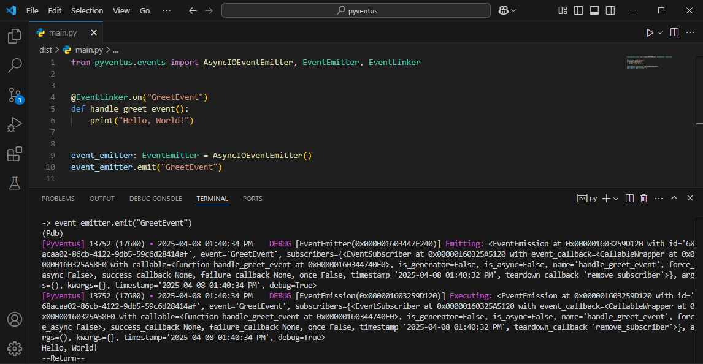

# Event Emitters

<p style="text-align: justify;">
	&emsp;&emsp;Now that your events and responses are all linked up, you may need a way to dispatch these events throughout your application and trigger their corresponding responses. For this purpose, Pyventus provides you with what is known as an Event Emitter.
</p>

<p style="text-align: justify;">
	&emsp;&emsp;The Event Emitter in Pyventus is essentially a base class that allows you to orchestrate the emission of events within your application in a modular and decoupled manner.
</p>

## Getting Started

<p style="text-align: justify;">
	&emsp;&emsp;In order to start working with the Event Emitter, the first thing you will need to do is to create a new instance of it. To do so, you will need what is known as an event processor, which is an instance of the Processing Service interface. This processor is crucial for the Event Emitter, as it is responsible for processing the emission of events.
</p>

=== ":material-console: Manual Creation"

    ```Python linenums="1" hl_lines="1 2 4"
    from pyventus.events import EventEmitter
    from pyventus.core.processing.asyncio import AsyncIOProcessingService  # (1)!

    event_emitter = EventEmitter(event_processor=AsyncIOProcessingService())
    event_emitter.emit("MyEvent")
    ```

    1.  You can import and use any of the supported processing services, or even create your own custom ones.

=== ":material-factory: Factory Method"

    ```Python linenums="1" hl_lines="1 4"
    from pyventus.events import AsyncIOEventEmitter, EventEmitter


    event_emitter: EventEmitter = AsyncIOEventEmitter()  # (1)!
    event_emitter.emit("MyEvent")
    ```

    1.  There is a factory method for each of the supported processing services. For reference, you can check the [Event Emitter utilities](../../../api/events/emitters/event_emitter_utils.md).

### Using Custom Event Linkers

<p style="text-align: justify;">
	&emsp;&emsp;By default, the Event Emitter comes with the base Event Linker class configured as the primary access point for events and their responses. However, you have the flexibility to specify the Event Linker class that the Event Emitter will use.
</p>

=== ":material-console: Manual Creation"

    ```Python linenums="1" hl_lines="5 7 11"
    from pyventus.events import EventEmitter, EventLinker
    from pyventus.core.processing.asyncio import AsyncIOProcessingService


    class CustomEventLinker(EventLinker): ...

    CustomEventLinker.subscribe("MyEvent", event_callback=print)
    EventLinker.subscribe("MyEvent", event_callback=print)  # (1)!

    event_emitter = EventEmitter(
        event_linker=CustomEventLinker,
        event_processor=AsyncIOProcessingService(),
    )
    event_emitter.emit("MyEvent", "Hello, World!")
    ```

    1.  This event subscriber will not be triggered, as it is subscribed to the Event Linker base class rather than the custom one that was created.

=== ":material-factory: Factory Method"

    ```Python linenums="1" hl_lines="4 7 12"
    from pyventus.events import AsyncIOEventEmitter, EventEmitter, EventLinker


    class CustomEventLinker(EventLinker): ...


    CustomEventLinker.subscribe("MyEvent", event_callback=print)
    EventLinker.subscribe("MyEvent", event_callback=print)  # (1)!


    event_emitter: EventEmitter = AsyncIOEventEmitter(
        event_linker=CustomEventLinker,
    )
    event_emitter.emit("MyEvent", "Hello, World!")
    ```

    1.  This event subscriber will not be triggered, as it is subscribed to the Event Linker base class rather than the custom one that was created.

### Using Custom Event Processors

<p style="text-align: justify;">
	&emsp;&emsp;If you need a different strategy for processing event emissions, you can easily do so by providing an instance of a subclass of the Processing Service interface to the Event Emitter.
</p>

```Python linenums="1" hl_lines="3 7 8 14"
import asyncio

from pyventus.core.processing import ProcessingService
from pyventus.events import EventEmitter, EventLinker


class CustomProcessingService(ProcessingService):
    def submit(self, callback, *args, **kwargs):  # (1)!
        coro = callback(*args, **kwargs)  # (2)!
        if asyncio.iscoroutine(coro):
            asyncio.run(coro)


event_emitter = EventEmitter(event_processor=CustomProcessingService())

EventLinker.subscribe("MyEvent", event_callback=print)
event_emitter.emit("MyEvent", "Hello, World!")
```

1.  Implement this method to define the processing strategy. See the example below.
2.  The given `callback` can be either a synchronous or an asynchronous Python function. For typing, you can refer to the base [submit()](../../../api/core/processing/index.md#pyventus.core.processing.ProcessingService.submit) method.

## Runtime Flexibility

<p style="text-align: justify;">
	&emsp;&emsp;Thanks to the separation of concerns between the Event Linker and the Event Emitter, you can easily change the Event Emitter at runtime without needing to reconfigure all connections or implement complex logic.
</p>

```Python linenums="1" hl_lines="6 14 15"
from concurrent.futures import ThreadPoolExecutor

from pyventus.events import AsyncIOEventEmitter, EventEmitter, EventLinker, ExecutorEventEmitter


def main(event_emitter: EventEmitter) -> None:
    event_emitter.emit("MyEvent", f"Using: {event_emitter}!")


if __name__ == "__main__":
    executor = ThreadPoolExecutor()
    EventLinker.subscribe("MyEvent", event_callback=print)

    main(event_emitter=AsyncIOEventEmitter())
    main(event_emitter=ExecutorEventEmitter(executor))

    executor.shutdown()
```

## Debug Mode

<p style="text-align: justify;">
	&emsp;&emsp;Pyventus' Event Emitter offers a useful debug mode feature to help you understand the flow of events and troubleshoot your event-driven application. You can enable debug mode in the Event Emitter using the following options:
</p>

### Global Debug Mode

<p style="text-align: justify;" markdown>
	&emsp;&emsp;By default, Pyventus leverages Python's global debug tracing feature to determine whether the code is running in debug mode or not. When this mode is enabled, all local debug flags are set to `True` unless they are already configured. To activate global debug mode, simply run your code in a debugger like [pdb](https://docs.python.org/3/library/pdb.html).
</p>

<p align="center">
   
</p>

### Instance Debug Mode

<p style="text-align: justify;" markdown>
    &emsp;&emsp;Alternatively, if you want to enable or disable debug mode for a specific Event Emitter instance, you can use the `debug` flag. Setting the `debug` flag to `True` enables debug mode for that instance, while setting it to `False` disables debug mode.
</p>

=== "Debug Mode `On`"

    ```Python linenums="1" hl_lines="3"
    from pyventus.events import AsyncIOEventEmitter, EventEmitter

    event_emitter: EventEmitter = AsyncIOEventEmitter(debug=True)
    event_emitter.emit("MyEvent", "Hello, World!")
    ```

=== "Debug Mode `Off`"

    ```Python linenums="1" hl_lines="3"
    from pyventus.events import AsyncIOEventEmitter, EventEmitter

    event_emitter: EventEmitter = AsyncIOEventEmitter(debug=False)
    event_emitter.emit("MyEvent", "Hello, World!")
    ```
