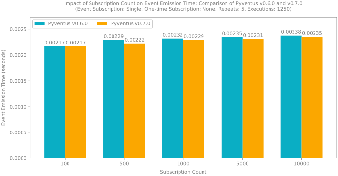
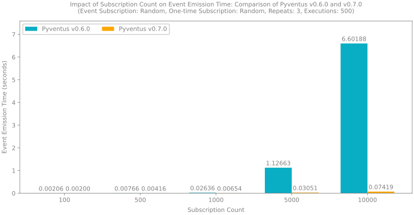

---
hide:
    - navigation
---

<style>
	.divider {
		margin-top: -0.5em !important;
		margin-bottom: -0.2em !important;
	}
</style>

[//]: # "--------------------------------------------------------------------------------------------------------------"

## [v0.7.0](https://github.com/mdapena/pyventus/releases/tag/0.7.0) <small>Unreleased</small> { id="0.7.0" }

<hr class="divider">

##### Breaking Changes { id="0.7.0-breaking-changes" }

-   The `typing-extensions` package is now a required dependency for Pyventus. This dependency has been added to support advanced typing features in older versions of Python.

-   All previous event-driven features must now be imported from the inner package `pyventus.events` instead of directly from `pyventus`. These changes were necessary due to the integration of the reactive programming paradigm. This series of refactors were implemented not only to ensure an organized codebase but also to establish a clear boundary between event handling and reactive programming features, enabling optimized imports based on the required paradigm.

-   The inheritance structure of the `EventEmitter` has been replaced with composition using the new `ProcessingService` interface. This interface establishes a common ground for processing calls, such as event emissions, in a decoupled and flexible manner. The `EventEmitter` is now a concrete class that requires a `ProcessingService` instance, referred to as `event_processor`, for initialization. These changes not only preserve the overall behavior and workflow of the `EventEmitter` but also enhance its modularity and flexibility.

-   The `EventLinker` class has experienced multiple method renames and return type modifications to align with the new redesigned codebase, enhancing the API for improved usability and intuitiveness. Below is a detailed list of the breaking changes made to the `EventLinker` class:

    -   The inner class `EventLinkageWrapper` was renamed to `EventLinkerSubCtx` for consistency with the new concept of a subscription context and now extends from the base class `SubscriptionContext`. The overall workflow remains roughly the same but was reworked to align with its base class and introduce optimizations based on user needs.
    -   The method `get_events()` now returns a `set` of all registered events instead of a `list` with non-duplicated events.
    -   The method `get_event_handlers()` was renamed to `get_subscribers()` for consistency, and it now returns a `set`of all registered subscribers instead of a `list` with non-duplicated subscribers.
    -   The method `get_events_by_event_handler()` was renamed to `get_events_from_subscribers()` for consistency. It now returns a `set` of events associated with the specified subscribers instead of a `list` of non-duplicated events associated with the specified subscribers. This method now also supports retrieving events from multiple subscribers instead of only one at a time.
    -   The method `get_event_handlers_by_events()` was renamed to `get_subscribers_from_events()` for consistency. It now returns a `set` of subscribers associated with the specified events instead of a `list` of non-duplicated subscribers associated with the provided events. Additionally, a new flag called `pop_onetime_subscribers` was added to remove and return those subscribers that are one-time subscriptions.
    -   The method `unsubscribe()` was renamed to `remove()` for consistency with the new concept of subscription and the encapsulation of the unsubscription process through the `teardown_callback`. This method now allows you to remove one event and subscriber from the registry at a time instead of multiple events of the given subscriber.
    -   The method `remove_event_handler()` was renamed to `remove_subscriber()` for consistency.
    -   Parameters named `event_handler` were renamed to `subscriber` for consistency.

-   The `EventHandler` has been refactored from a class to an interface, outlining the overall workflow and essential protocols for event handling. However, the previous implementation of the `EventHandler` has been transitioned to one of its concrete classes named `EventSubscriber`. This new `EventSubscriber` class not only implements the `EventHandler` interface but also combines it with the `Subscription` base class, providing a convenient way to both handle event responses and manage the subscription lifecycle.

##### Added { id="0.7.0-added" }

-   Added a reactive programming module to expand Python's event-driven capabilities for data-oriented processes and the ability to react efficiently to state changes over time.

    -   Added the `Observable` base class, which defines a lazy push-style notification mechanism for streaming data to subscribers.
    -   Added the `ObservableTask` class, an observable subclass that encapsulates a unit of work and offers a mechanism for streaming its results reactively.
    -   Added the `as_observable_task()` decorator to easily convert any given callable into an observable task.
    -   Added the `Observer` interface, which defines the overall workflow and essential protocols for responding to notifications from an observable.
    -   Added the `Subscriber` class, which combines the `Observer` interface with the `Subscription` base class to provide a convenient way to respond to state changes emitted by an observable and manage the subscription lifecycle.

-   Added the `Unsubscribable` interface, which provides a standardized method for objects to unsubscribe from a source and release any associated resources.

-   Added the `Subscription` base class to simplify subscription management and resource cleanup with a `teardown_callback` that is called during unsubscription.

-   Added the `SubscriptionContext` base class, which defines the overall workflow for subscription contexts, allowing the user to define step-by-step the object that will later be subscribed to the specified source.

-   Added a new package global exception called `PyventusImportException`, which is a custom Pyventus exception for handling missing imports within the library.

-   Added the `MultiBidict` data structure, a generic multikeyed, multivalued bidirectional dictionary that offers a flexible mapping structure for efficient lookups, updates, and deletions of keys and their corresponding values.

-   Introduced the `ProcessingService` interface to define flexible execution strategies for various use cases. This release includes the following concrete implementations:

    -   `AsyncIOProcessingService`: A processing service that utilizes the `AsyncIO` framework to handle the execution of calls.
    -   `CeleryProcessingService`: A processing service that utilizes the `Celery` framework to handle the execution of calls.
    -   `ExecutorProcessingService`: A processing service that utilizes the Python's `Executor` to handle the execution of calls.
    -   `FastAPIProcessingService`: A processing service that uses FastAPI's `BackgroundTasks` to handle the execution of calls.
    -   `RedisProcessingService`: A processing service that utilizes the `Redis Queue` framework to handle the execution of calls.

-   Added the `CallableWrapper` class to encapsulate callables and provide a unified asynchronous interface for their execution.

-   Added new features to the `EventLinker` class, including the following methods:

    -   Introduced the `get_valid_subscriber()` method for a centralized mechanism to validate event subscribers.
    -   Added the `is_empty()` method to efficiently check if the main registry is empty.
    -   Added the `get_event_count()` method to return the total number of events in the registry.
    -   Added the `get_subscriber_count()` method to return the total number of subscribers in the registry.
    -   Added the `get_event_count_from_subscriber()` method to return the number of events for a specific subscriber.
    -   Added the `get_subscriber_count_from_event()` method to return the number of subscribers for a specific event.
    -   Added the `contains_event()` method to check if a specific event is present in the registry.
    -   Added the `contains_subscriber()` method to check if a specific subscriber is present in the registry.
    -   Added the `are_linked()` method to determine if a specific event is linked to a given subscriber.
    -   Introduced the `stateful_subctx` parameter in the `once()` and `on()` methods to configure the `EventLinkerSubCtx` behavior and optimize the subscription context based on user needs.

-   Introduced the `EventSubscriber` class, which combines event handling capabilities with subscription lifecycle management.

-   A new `benchmarks` package has been added to the `tests` directory for performance evaluation of Pyventus. This release introduces the `EventEmitterBenchmark`, which measures the efficiency of the `EventEmitter` in handling event emissions.

-   Added a set of utilities for creating preconfigured event emitter instances, making the setup process easier. These utilities also provide retro compatibility with the previous class-based design.

##### Changed { id="0.7.0-changed" }

-   Enhanced the `emit()` method in the `EventEmitter` to support the emission of global events (`...`).

-   Moved callback utilities to a dedicated module within `pyventus.core` for improved organization and reusability.

-   Standardized the structure of Python classes and their representation, including the use of the `@override()` decorator for consistency and `mypy` static type checking.

-   Standardized the structure of the `pyproject.toml` file.

-   Enhanced Pyventus logs by adding process and thread IDs for better debugging.

-   Switched from the `Black` formatter to `Ruff` for improved development efficiency and enhanced code quality.

-   Refactored all project docstrings to follow a standardized format, enhancing consistency and clarity in the documentation.

-   Upgraded several development dependencies in the `pyproject.toml`, including `pytest-asyncio` from version `0.21.0` to `0.24.0`, to enable global configuration of the `asyncio_mode`.

-   Simplified the `EventCallbackType` type alias by removing the unnecessary `ParamSpec`.

-   Refactored the test suite to improve validation across all package features, ensuring correctness and achieving 100% code coverage.

##### Optimized { id="0.7.0-optimized" }

-   The time complexity of the `emit()` method in the `EventEmitter` class has been significantly optimized. It has been reduced from $O(E \cdot S^2)$ to $O(E \cdot S)$, where:

    -   $E$: Denotes the total number of events in the event linker.
    -   $S$: Corresponds to the total number of subscribers in the event linker.

    &nbsp;&nbsp;&nbsp;&nbsp;&nbsp;&nbsp;&nbsp;&nbsp;This optimization results from the more efficient management of one-time subscribers by the event linker during event emission. Instead of traversing the entire event linker registry to remove each one-time subscriber involved in the event emission, it now iterates solely through the linked events.

-   Major optimizations have been implemented for the `EventLinker` class through the integration of the `MultiBidict` data structure. This data structure is a multikeyed, multivalued bidirectional dictionary implementation that enables efficient lookups, updates, and deletions of events and their corresponding subscribers. Despite utilizing a bidirectional mapping structure, its memory footprint remains minimal due to the use of references between keys and values instead of duplication, which limits the impact to the additional dictionary and set data structures.

    -   The time complexity of the method `get_subscribers()`, previously known as `get_event_handlers()`, has been reduced from $O(E \cdot S)$ to $O(S)$, where:

        -   $E$: Denotes the total number of events in the event linker.
        -   $S$: Corresponds to the total number of subscribers in the event linker.

    -   The time complexity of the `get_events_from_subscribers()`, previously known as `get_events_by_event_handler()`, has been reduced from $O(E \cdot S)$ to $O(E)$, where:

        -   $E$: Denotes the total number of events in the event linker.
        -   $S$: Corresponds to the total number of subscribers in the event linker.

    -   The time complexity of the method `remove()`, previously known as `unsubscribe()`, has been enhanced from $O(S)$ to a constant time complexity of $O(1)$, where:

        -   $S$: Corresponds to the total number of subscribers in the event linker.

    -   The time complexity of the method `remove_subscriber()`, previously known as `remove_event_handler()`, has been reduced from $O(E \cdot S)$ to $O(E)$, where:

        -   $E$: Denotes the total number of events in the event linker.
        -   $S$: Corresponds to the total number of subscribers in the event linker.

-   Introduced `__slots__` in several classes to optimize memory usage and enhance attribute access speed.

##### Benchmarks { id="0.7.0-benchmarks" }

&nbsp;&nbsp;&nbsp;&nbsp;&nbsp;&nbsp;&nbsp;&nbsp;Finally, to provide a quick visualization of the overall improvements and illustrate the time complexity enhancements of this release, a series of benchmarks were conducted. These benchmarks were specifically designed for the event emission process, as it encompasses all event-driven features and provides a clear overview of the improvements. Following this, a detailed explanation of the benchmarks and their results is presented.

-   **Methodology:** The benchmarks utilized a volume testing approach to assess how different subscription counts affect the event emission time.

-   **Environment:** The benchmarks were conducted in the following environment:

    -   **Operating System**: Windows 11 64bit (v10.0.22631)
    -   **CPU**: AMD Ryzen 5 2600, 3400.0 MHz, 6 cores, 12 logical processors
    -   **Total Memory**: 16 GB
    -   **Python Version**: 3.12.7

-   **Setup:** The benchmark setup consisted of two key components: a main Python script that managed the overall workflow of the benchmarks and the `EventEmitterBenchmark` class, which was essential for standardizing and organizing the performance tests. Following this, the main workflow of the benchmarks will be outlined, including the required packages and the adjustable settings available for different tests.

    <details markdown="1" class="quote">
    <summary>Benchmark Workflow and Settings (`main.py`)</summary>

    Before running the benchmarks, make sure all necessary packages are installed. You can install them using the following `pip` command:

    ```console
    pip install pyventus[tests]
    ```

    Additionally, an extra package is required for visualizing the results: `matplotlib`. You can also install it with a `pip` command as follows:

    ```console
    pip install matplotlib
    ```

    Once the packages are installed, you can configure the benchmarks in the `main.py` script as needed and execute it. The script will first install Pyventus `v0.6.0`, run the benchmarks in a separate process, and then uninstall it. Next, it will install the current version of Pyventus and run the benchmarks again in another process. Finally, the results for each version will be saved in a `JSON` file, and plots will be generated based on the benchmark reports.

    ```Python title="main.py" linenums="1"
    import gc
    import os
    import subprocess
    import sys
    from concurrent.futures import ProcessPoolExecutor
    from dataclasses import asdict
    from json import dumps

    import matplotlib.pyplot as plt
    import numpy as np

    def run_event_emitter_benchmarks():
    	from tests.benchmarks.event_emitter_benchmark import EventEmitterBenchmark

    	print(f"Pyventus v{EventEmitterBenchmark.PYVENTUS_VERSION}\n")
    	print("Starting benchmarks...")

    	# Define a list of benchmarks to run with different configurations.
    	benchmarks: list[EventEmitterBenchmark] = [
    		# Benchmark with SINGLE event subscription mode and NONE one-time subscriptions.
    		EventEmitterBenchmark(
    			event_subscription_mode=EventEmitterBenchmark.EventSubscriptionMode.SINGLE,
    			onetime_subscription_mode=EventEmitterBenchmark.OneTimeSubscriptionMode.NONE,
    			subscription_sizes=[100, 500, 1000, 5000, 10000],
    			num_repeats=5,
    			num_executions=1250,
    		),
    		# Benchmark with SINGLE event subscription mode and ALL one-time subscriptions.
    		EventEmitterBenchmark(
    			event_subscription_mode=EventEmitterBenchmark.EventSubscriptionMode.SINGLE,
    			onetime_subscription_mode=EventEmitterBenchmark.OneTimeSubscriptionMode.ALL,
    			subscription_sizes=[100, 500, 1000, 5000, 10000],
    			num_repeats=5,
    			num_executions=1250,
    		),
    		# Benchmark with ALL event subscription mode and ALL one-time subscriptions.
    		EventEmitterBenchmark(
    			event_subscription_mode=EventEmitterBenchmark.EventSubscriptionMode.ALL,
    			onetime_subscription_mode=EventEmitterBenchmark.OneTimeSubscriptionMode.ALL,
    			subscription_sizes=[100, 500, 1000, 5000, 10000],
    			num_repeats=5,
    			num_executions=1250,
    		),
    		# Benchmark with RANDOM event subscription mode and RANDOM one-time subscriptions.
    		EventEmitterBenchmark(
    			event_subscription_mode=EventEmitterBenchmark.EventSubscriptionMode.RANDOM,
    			onetime_subscription_mode=EventEmitterBenchmark.OneTimeSubscriptionMode.RANDOM,
    			subscription_sizes=[100, 500, 1000, 5000, 10000],
    			num_repeats=3,
    			num_executions=500,
    		),
    	]

    	# Initialize an empty list to store reports generated by the benchmarks.
    	reports: list[EventEmitterBenchmark.Report] = []

    	# Iterate through each benchmark and execute it.
    	for benchmark in benchmarks:
    		reports.append(benchmark())

    	# Return the list of reports.
    	return reports

    def plot_event_emitter_benchmark_comparison(
    	title: str, subscription_sizes: list[int], benchmark_bars: dict[tuple[str, str], list[float]], output_file: str
    ) -> None:
    	# Prepare the x positions for the bars based on the number of subscription sizes
    	x_positions = np.arange(len(subscription_sizes))
    	bar_width = 0.355  # Width of each bar
    	bar_offset = 0  # Offset for positioning bars

    	# Create a figure and axis for the plot
    	fig, ax = plt.subplots(figsize=(9.6, 5), layout="constrained")

    	# Initialize the maximum y-value for setting the y-axis limit later
    	max_y_value = 0

    	# Loop through each benchmark report to create bars
    	for (label, color), heights in benchmark_bars.items():
    		# Calculate the offset for the current set of bars
    		current_offset = bar_width * bar_offset

    		# Create bars for the current benchmark data
    		bars = ax.bar(x=(x_positions + current_offset), height=heights, width=bar_width, label=label, color=color)

    		# Add labels on top of the bars with formatted emission times
    		ax.bar_label(bars, padding=2, fontsize=10, fmt=lambda value: f"{value:.5f}")

    		# Update the maximum y-value if the current heights exceed it
    		max_y_value = max(max(heights), max_y_value)

    		# Increment the offset for the next set of bars
    		bar_offset += 1

    	# Set plot title and labels
    	ax.set_title(title, fontsize=10, pad=0)
    	ax.legend(loc="upper left", ncols=3)
    	ax.set_xlabel("Subscription Count", labelpad=7)
    	ax.set_ylabel("Event Emission Time (seconds)", labelpad=7)

    	# Set x-ticks to correspond to subscription sizes
    	ax.set_xticks(x_positions + (bar_width / 2), subscription_sizes)

    	# Set y-axis limit to accommodate the highest bar with some padding
    	ax.set_ylim(ymax=max_y_value + (max_y_value * 0.15), auto=True)

    	# Save the plot to the specified filename
    	plt.savefig(output_file)

    def main():
    	def clear_console():
    		"""Clear the console based on the operating system."""
    		if os.name == "nt":  # For Windows
    			os.system("cls")
    		else:  # For macOS and Linux
    			os.system("clear")

    	def uninstall_pyventus() -> None:
    		"""Uninstall the currently installed version of pyventus using pip."""
    		subprocess.check_call([sys.executable, "-m", "pip", "uninstall", "-y", "pyventus"])

    	def install_pyventus(version: str = "") -> None:
    		"""Install pyventus using pip, with an optional version parameter."""
    		version = ("." if version == "." else (f"pyventus=={version}" if version else "pyventus"))
    		subprocess.check_call([sys.executable, "-m", "pip", "install", version])

    	# Uninstall the currently installed version of pyventus to avoid conflicts
    	# and ensure a clean environment for the installation of the specified version (0.6.0).
    	uninstall_pyventus()
    	install_pyventus(version="0.6.0")
    	clear_console()

    	# Run the benchmark with pyventus v0.6.0 in a separate process to avoid conflicts.
    	with ProcessPoolExecutor() as executor:
    		fut = executor.submit(run_event_emitter_benchmarks)
    		pyventus_v060_reports = fut.result()
    		clear_console()

    	# Remove executor reference
    	del executor

    	# Uninstall the current version of pyventus again to prepare for the next version.
    	uninstall_pyventus()
    	install_pyventus(version=".")
    	clear_console()

    	# Force a garbage collection.
    	gc.collect()

    	# Run the benchmark with the current version of pyventus (0.7.0) in a separate process.
    	with ProcessPoolExecutor() as executor:
    		fut = executor.submit(run_event_emitter_benchmarks)
    		pyventus_v070_reports = fut.result()
    		clear_console()

    	print("Almost done. Saving reports...")

    	# Save the reports for pyventus v0.6.0 to a JSON file.
    	with open("dist/pyventus_v060_eeb_reports.json", "w") as f1:
    		f1.write(f"{dumps([asdict(report) for report in pyventus_v060_reports])}\n")

    	# Save the reports for pyventus v0.7.0 to a JSON file.
    	with open("dist/pyventus_v070_eeb_reports.json", "w") as f2:
    		f2.write(f"{dumps([asdict(report) for report in pyventus_v070_reports])}\n")

    	clear_console()

    	# Indicate that charts are being generated.
    	print("Generating charts...")

    	# Generate comparison charts for the two versions of pyventus.
    	for i, (v060_report, v070_report) in enumerate(zip(pyventus_v060_reports, pyventus_v070_reports, strict=False)):
    		plot_event_emitter_benchmark_comparison(
    			title=(
    				f"Impact of Subscription Count on Event Emission Time: Comparison of Pyventus v0.6.0 and v0.7.0\n"
    				f"(Event Subscription: {v060_report.event_subscription_mode.capitalize()}, "
    				f"One-time Subscription: {v060_report.onetime_subscription_mode.capitalize()}, "
    				f"Repeats: {v060_report.num_repeats}, Executions: {v060_report.num_executions})\n"
    			),
    			subscription_sizes=v060_report.subscription_sizes,
    			benchmark_bars={
    				("Pyventus v0.6.0", "#0aaec4"): [
    					measurement.execution_time for measurement in v060_report.measurements
    				],
    				("Pyventus v0.7.0", "#fba700"): [
    					measurement.execution_time for measurement in v070_report.measurements
    				],
    			},
    			output_file=f"dist/pyventus_eeb_chart_{i}.png",
    		)

    	print("All Done!")

    if __name__ == "__main__":
    	main()
    ```

    As shown in the previous script, the `EventEmitterBenchmark` class provides several parameters that can be configured to tailor the performance tests for various scenarios. This flexibility enables a comprehensive evaluation of the event emission process. Below are the key configurations available in the `EventEmitterBenchmark` class:

    -   **Event Subscription Mode:** This parameter defines how event subscriptions behave during the benchmark.

        -   **Single:** In this mode, each subscriber is limited to a single event.
        -   **Random:** This mode allows subscribers to register for the specified event along with a random selection of additional events from the registry.
        -   **All:** When this mode is selected, subscribers will register for the specified event as well as all other registered events.

    -   **One-Time Subscription Mode:** This parameter defines how one-time subscriptions are handled in the benchmark.

        -   **None:** In this mode, no one-time subscribers will be registered; the `once` property is always set to `False`.
        -   **Random:** This mode randomizes the `once` property, allowing for a mix of one-time and regular subscriptions.
        -   **All:** When this mode is selected, all subscriptions are treated as one-time subscriptions; the `once` property is always set to `True`.

    -   **Subscription Sizes:** This parameter specifies a list of varying subscription sizes used in the benchmark.

        -   A mathematical formula is employed to proportionally subdivide the number of events and subscribers based on the specified subscription size.

            -   **Number of Events:** Calculated as: $\lfloor \sqrt{num\_subscriptions} \rfloor$.
            -   **Subscribers per Event:** Calculated as: $\lfloor num\_subscriptions/num\_events \rfloor$.
            -   **Remaining Subscribers:** Calculated as: $num\_subscriptions - num\_events \cdot num\_subscribers$.

        -   Note that depending on the selected event subscription mode, the number of subscribers per event may exceed the calculated proportion. For instance, if the event subscription mode is set to `ALL`, each subscriber will be registered across all event sets, resulting in each event set's length being equal to the subscription size.

    -   **Number of Repeats:** This parameter indicates how many times the benchmark is repeated.
    -   **Number of Executions:** This parameter represents the total number of executions performed during the benchmark.

    </details>

-   **Metrics Collected:** The main metric used to assess the efficiency of the event emission process during the performance tests is the _Event Emission Time_. This metric tracks the time (in seconds) that it takes to complete the event emission process for each subscription size.

-   **Calculation Method**: To determine the event emission time for a given subscription size, the event emission process is executed multiple times (as specified by `num_executions`) and repeated for a number of iterations (as declared by `num_repeats`). The elapsed time for each execution is recorded, and the median of these recorded times is calculated to establish the event emission time for that repetition, which helps reduce the impact of outliers. Once all repetitions are completed, the final event emission time is determined by calculating the mean of the medians from each repetition. Additionally, to minimize timing noise, the garbage collector is disabled during the tests, and the `perf_counter` function is used for accurate measurements.

-   **Results:**

    -   **Event Emitter Benchmark 01:** This benchmark was configured with the event subscription mode set to **Single** and the one-time subscription mode set to **None**. The test was repeated **5** times, with **1,250** executions for each benchmark repetition.

        <details markdown="1" class="quote">
        <summary>Benchmark Report (`JSON` format)</summary>
        ```json title="pyventus_v060_eeb_report.json" linenums="1"
        {
          "title": "EventEmitterBenchmark(event_subscription_mode=SINGLE, onetime_subscription_mode=NONE)",
          "pyventus_version": "0.6.0",
          "benchmark_duration": 1555.6348432,
          "event_subscription_mode": "Single",
          "onetime_subscription_mode": "None",
          "subscription_sizes": [
            100,
            500,
            1000,
            5000,
            10000
          ],
          "num_repeats": 5,
          "num_executions": 1250,
          "measurements": [
            {
              "num_subscriptions": 100,
              "execution_time": 0.0021713468276594356
            },
            {
              "num_subscriptions": 500,
              "execution_time": 0.0022923071408520593
            },
            {
              "num_subscriptions": 1000,
              "execution_time": 0.002319530000003561
            },
            {
              "num_subscriptions": 5000,
              "execution_time": 0.00234521428777057
            },
            {
              "num_subscriptions": 10000,
              "execution_time": 0.002376250000902652
            }
          ]
        }
        ```
        ```json title="pyventus_v070_eeb_report.json" linenums="1"
        {
          "title": "EventEmitterBenchmark(event_subscription_mode=SINGLE, onetime_subscription_mode=NONE)",
          "pyventus_version": "0.7.0",
          "benchmark_duration": 2232.0822847000018,
          "event_subscription_mode": "Single",
          "onetime_subscription_mode": "None",
          "subscription_sizes": [
            100,
            500,
            1000,
            5000,
            10000
          ],
          "num_repeats": 5,
          "num_executions": 1250,
          "measurements": [
            {
              "num_subscriptions": 100,
              "execution_time": 0.0021696501370083562
            },
            {
              "num_subscriptions": 500,
              "execution_time": 0.002224228570831580
            },
            {
              "num_subscriptions": 1000,
              "execution_time": 0.00229092857083158
            },
            {
              "num_subscriptions": 5000,
              "execution_time": 0.002311342857417113
            },
            {
              "num_subscriptions": 10000,
              "execution_time": 0.00235225142652442
            }
          ]
        }
        ```
        </details>

        <table align="center">
         <thead>
         <tr>
           <th>Subscription Size</th>
           <th>Metric</th>
           <th>Pyventus <code>v0.6.0</code></th>
           <th>Pyventus <code>v0.7.0</code></th>
           <th>Improvement</th>
          </tr>
         </thead>
         <tbody>
         <tr>
           <td>100</td>
           <td>Event Emission Time (s)</td>
           <td>0.00217135</td>
           <td>0.00216965</td>
           <td><span style="color:var(--md-code-hl-string-color)">:material-arrow-up-thin:0.08%</span> faster</td>
          </tr>
         <tr>
           <td>500</td>
           <td>Event Emission Time (s)</td>
           <td>0.00229231</td>
           <td>0.00222423</td>
           <td><span style="color:var(--md-code-hl-string-color)">:material-arrow-up-thin:2.97%</span> faster</td>
          </tr>
         <tr>
           <td>1000</td>
           <td>Event Emission Time (s)</td>
           <td>0.00231953</td>
           <td>0.00229093</td>
           <td><span style="color:var(--md-code-hl-string-color)">:material-arrow-up-thin:1.23%</span> faster</td>
         </tr>
         <tr>
           <td>1000</td>
           <td>Event Emission Time (s)</td>
           <td>0.00234521</td>
           <td>0.00231134</td>
           <td><span style="color:var(--md-code-hl-string-color)">:material-arrow-up-thin:1.44%</span> faster</td>
         </tr>
         <tr>
           <td>10000</td>
           <td>Event Emission Time (s)</td>
           <td>0.00237625</td>
           <td>0.00235225</td>
           <td><span style="color:var(--md-code-hl-string-color)">:material-arrow-up-thin:1.01%</span> faster</td>
         </tr>
         <tr>
          <td style="text-align: center" colspan="5">
           { align=center }
          </td>
         </tr>
         </tbody>
        </table>

    -   **Event Emitter Benchmark 02:** This benchmark was configured with the event subscription mode set to **Single** and the one-time subscription mode set to **All**. The test was repeated **5** times, with **1,250** executions for each benchmark repetition.

        <details markdown="1" class="quote">
        <summary>Benchmark Report (`JSON` format)</summary>
        ```json title="pyventus_v060_eeb_report.json" linenums="1"
        {
          "title": "EventEmitterBenchmark(event_subscription_mode=SINGLE, onetime_subscription_mode=ALL)",
          "pyventus_version": "0.6.0",
          "benchmark_duration": 1613.8905598000001,
          "event_subscription_mode": "Single",
          "onetime_subscription_mode": "All",
          "subscription_sizes": [
            100,
            500,
            1000,
            5000,
            10000
          ],
          "num_repeats": 5,
          "num_executions": 1250,
          "measurements": [
            {
              "num_subscriptions": 100,
              "execution_time": 0.00215918000001238
            },
            {
              "num_subscriptions": 500,
              "execution_time": 0.002478313333360442
            },
            {
              "num_subscriptions": 1000,
              "execution_time": 0.00263769000002866
            },
            {
              "num_subscriptions": 5000,
              "execution_time": 0.0049624499999026707
            },
            {
              "num_subscriptions": 10000,
              "execution_time": 0.009284669999897231
            }
          ]
        }
        ```
        ```json title="pyventus_v070_eeb_report.json" linenums="1"
        {
          "title": "EventEmitterBenchmark(event_subscription_mode=SINGLE, onetime_subscription_mode=ALL)",
          "pyventus_version": "0.7.0",
          "benchmark_duration": 2257.228092499994,
          "event_subscription_mode": "Single",
          "onetime_subscription_mode": "All",
          "subscription_sizes": [
            100,
            500,
            1000,
            5000,
            10000
          ],
          "num_repeats": 5,
          "num_executions": 1250,
          "measurements": [
            {
              "num_subscriptions": 100,
              "execution_time": 0.002121700000892163
            },
            {
              "num_subscriptions": 500,
              "execution_time": 0.0022747199998723815
            },
            {
              "num_subscriptions": 1000,
              "execution_time": 0.00231161000054562
            },
            {
              "num_subscriptions": 5000,
              "execution_time": 0.0023325299973394723
            },
            {
              "num_subscriptions": 10000,
              "execution_time": 0.0023679700057022275
            }
          ]
        }
        ```
        </details>

        <table align="center">
         <thead>
         <tr>
           <th>Subscription Size</th>
           <th>Metric</th>
           <th>Pyventus <code>v0.6.0</code></th>
           <th>Pyventus <code>v0.7.0</code></th>
           <th>Improvement</th>
          </tr>
         </thead>
         <tbody>
         <tr>
           <td>100</td>
           <td>Event Emission Time (s)</td>
           <td>0.00215918</td>
           <td>0.00212170</td>
           <td><span style="color:var(--md-code-hl-string-color)">:material-arrow-up-thin:1.74%</span> faster</td>
          </tr>
         <tr>
           <td>500</td>
           <td>Event Emission Time (s)</td>
           <td>0.00247831</td>
           <td>0.00227472</td>
           <td><span style="color:var(--md-code-hl-string-color)">:material-arrow-up-thin:8.21%</span> faster</td>
          </tr>
         <tr>
           <td>1000</td>
           <td>Event Emission Time (s)</td>
           <td>0.00263769</td>
           <td>0.00231161</td>
           <td><span style="color:var(--md-code-hl-string-color)">:material-arrow-up-thin:12.36%</span> faster</td>
         </tr>
         <tr>
           <td>5000</td>
           <td>Event Emission Time (s)</td>
           <td>0.00496245</td>
           <td>0.00233253</td>
           <td><span style="color:var(--md-code-hl-string-color)">:material-arrow-up-thin:53%</span> faster</td>
         </tr>
         <tr>
           <td>10000</td>
           <td>Event Emission Time (s)</td>
           <td>0.00928467</td>
           <td>0.00236797</td>
           <td><span style="color:var(--md-code-hl-string-color)">:material-arrow-up-thin:74.5%</span> faster</td>
         </tr>
         <tr>
          <td style="text-align: center" colspan="5">
           { align=center }
          </td>
         </tr>
         </tbody>
        </table>

    -   **Event Emitter Benchmark 03:** This benchmark was configured with the event subscription mode set to **All** and the one-time subscription mode set to **All**. The test was repeated **5** times, with **1,250** executions for each benchmark repetition.

        <details markdown="1" class="quote">
        <summary>Benchmark Report (`JSON` format)</summary>
        ```json title="pyventus_v060_eeb_report.json" linenums="1"
        {
          "title": "EventEmitterBenchmark(event_subscription_mode=ALL, onetime_subscription_mode=ALL)",
          "pyventus_version": "0.6.0",
          "benchmark_duration": 16962.5048258,
          "event_subscription_mode": "All",
          "onetime_subscription_mode": "All",
          "subscription_sizes": [
            100,
            500,
            1000,
            5000,
            10000
          ],
          "num_repeats": 5,
          "num_executions": 1250,
          "measurements": [
            {
              "num_subscriptions": 100,
              "execution_time": 0.0032661600000665203
            },
            {
              "num_subscriptions": 500,
              "execution_time": 0.009857880000072327
            },
            {
              "num_subscriptions": 1000,
              "execution_time": 0.02087080000010246
            },
            {
              "num_subscriptions": 5000,
              "execution_time": 0.30020038000020577
            },
            {
              "num_subscriptions": 10000,
              "execution_time": 1.607526350000171
            }
          ]
        }
        ```
        ```json title="pyventus_v070_eeb_report.json" linenums="1"
        {
          "title": "EventEmitterBenchmark(event_subscription_mode=ALL, onetime_subscription_mode=ALL)",
          "pyventus_version": "0.7.0",
          "benchmark_duration": 9898.425464699998,
          "event_subscription_mode": "All",
          "onetime_subscription_mode": "All",
          "subscription_sizes": [
            100,
            500,
            1000,
            5000,
            10000
          ],
          "num_repeats": 5,
          "num_executions": 1250,
          "measurements": [
            {
              "num_subscriptions": 100,
              "execution_time": 0.002867740001238417
            },
            {
              "num_subscriptions": 500,
              "execution_time": 0.007017190001351992
            },
            {
              "num_subscriptions": 1000,
              "execution_time": 0.01340035999965039
            },
            {
              "num_subscriptions": 5000,
              "execution_time": 0.10753672999926493
            },
            {
              "num_subscriptions": 10000,
              "execution_time": 0.2562398899979598
            }
          ]
        }
        ```
        </details>

        <table align="center">
         <thead>
         <tr>
           <th>Subscription Size</th>
           <th>Metric</th>
           <th>Pyventus <code>v0.6.0</code></th>
           <th>Pyventus <code>v0.7.0</code></th>
           <th>Improvement</th>
          </tr>
         </thead>
         <tbody>
         <tr>
           <td>100</td>
           <td>Event Emission Time (s)</td>
           <td>0.00326616</td>
           <td>0.00286774</td>
           <td><span style="color:var(--md-code-hl-string-color)">:material-arrow-up-thin:12.2%</span> faster</td>
          </tr>
         <tr>
           <td>500</td>
           <td>Event Emission Time (s)</td>
           <td>0.00985788</td>
           <td>0.00701719</td>
           <td><span style="color:var(--md-code-hl-string-color)">:material-arrow-up-thin:28.82%</span> faster</td>
          </tr>
         <tr>
           <td>1000</td>
           <td>Event Emission Time (s)</td>
           <td>0.02087080</td>
           <td>0.01340036</td>
           <td><span style="color:var(--md-code-hl-string-color)">:material-arrow-up-thin:35.79%</span> faster</td>
         </tr>
         <tr>
           <td>5000</td>
           <td>Event Emission Time (s)</td>
           <td>0.30020038</td>
           <td>0.10753673</td>
           <td><span style="color:var(--md-code-hl-string-color)">:material-arrow-up-thin:64.18%</span> faster</td>
         </tr>
         <tr>
           <td>10000</td>
           <td>Event Emission Time (s)</td>
           <td>1.60752635</td>
           <td>0.25623989</td>
           <td><span style="color:var(--md-code-hl-string-color)">:material-arrow-up-thin:84.06%</span> faster</td>
         </tr>
         <tr>
          <td style="text-align: center" colspan="5">
           { align=center }
          </td>
         </tr>
         </tbody>
        </table>

    -   **Event Emitter Benchmark 04:** This benchmark was configured with both the event and one-time subscription modes set to **Random**. The test was repeated **3** times, with **500** executions for each benchmark repetition.

        <details markdown="1" class="quote">
        <summary>Benchmark Report (`JSON` format)</summary>
        ```json title="pyventus_v060_eeb_report.json" linenums="1"
            {
          "title": "EventEmitterBenchmark(event_subscription_mode=RANDOM, onetime_subscription_mode=RANDOM)",
          "pyventus_version": "0.6.0",
          "benchmark_duration": 12883.082557200003,
          "event_subscription_mode": "Random",
          "onetime_subscription_mode": "Random",
          "subscription_sizes": [
            100,
            500,
            1000,
            5000,
            10000
          ],
          "num_repeats": 3,
          "num_executions": 500,
          "measurements": [
            {
              "num_subscriptions": 100,
              "execution_time": 0.0020576499997938904
            },
            {
              "num_subscriptions": 500,
              "execution_time": 0.007661850000052557
            },
            {
              "num_subscriptions": 1000,
              "execution_time": 0.026361883333568887
            },
            {
              "num_subscriptions": 5000,
              "execution_time": 1.1266335333342188
            },
            {
              "num_subscriptions": 10000,
              "execution_time": 6.6018846833333855
            }
          ]
        }
        ```
        ```json title="pyventus_v070_eeb_report.json" linenums="1"
            {
          "title": "EventEmitterBenchmark(event_subscription_mode=RANDOM, onetime_subscription_mode=RANDOM)",
          "pyventus_version": "0.7.0",
          "benchmark_duration": 1836.9729208999997,
          "event_subscription_mode": "Random",
          "onetime_subscription_mode": "Random",
          "subscription_sizes": [
            100,
            500,
            1000,
            5000,
            10000
          ],
          "num_repeats": 3,
          "num_executions": 500,
          "measurements": [
            {
              "num_subscriptions": 100,
              "execution_time": 0.0020046499994350597
            },
            {
              "num_subscriptions": 500,
              "execution_time": 0.004163983332546195
            },
            {
              "num_subscriptions": 1000,
              "execution_time": 0.006543066667897317
            },
            {
              "num_subscriptions": 5000,
              "execution_time": 0.03050753333324489
            },
            {
              "num_subscriptions": 10000,
              "execution_time": 0.07419393333475455
            }
          ]
        }
        ```
        </details>

        <table align="center">
         <thead>
         <tr>
           <th>Subscription Size</th>
           <th>Metric</th>
           <th>Pyventus <code>v0.6.0</code></th>
           <th>Pyventus <code>v0.7.0</code></th>
           <th>Improvement</th>
          </tr>
         </thead>
         <tbody>
         <tr>
           <td>100</td>
           <td>Event Emission Time (s)</td>
           <td>0.00205765</td>
           <td>0.00200465</td>
           <td><span style="color:var(--md-code-hl-string-color)">:material-arrow-up-thin:2.64%</span> faster</td>
          </tr>
         <tr>
           <td>500</td>
           <td>Event Emission Time (s)</td>
           <td>0.00766185</td>
           <td>0.00416398</td>
           <td><span style="color:var(--md-code-hl-string-color)">:material-arrow-up-thin:45.65%</span> faster</td>
          </tr>
         <tr>
           <td>1000</td>
           <td>Event Emission Time (s)</td>
           <td>0.02636188</td>
           <td>0.00654307</td>
           <td><span style="color:var(--md-code-hl-string-color)">:material-arrow-up-thin:75.18%</span> faster</td>
         </tr>
         <tr>
           <td>5000</td>
           <td>Event Emission Time (s)</td>
           <td>1.12663353</td>
           <td>0.03050753</td>
           <td><span style="color:var(--md-code-hl-string-color)">:material-arrow-up-thin:97.29%</span> faster</td>
         </tr>
         <tr>
           <td>10000</td>
           <td>Event Emission Time (s)</td>
           <td>6.60188468</td>
           <td>0.07419393</td>
           <td><span style="color:var(--md-code-hl-string-color)">:material-arrow-up-thin:98.88%</span> faster</td>
         </tr>
         <tr>
          <td style="text-align: center" colspan="5">
           { align=center }
          </td>
         </tr>
         </tbody>
        </table>

    &nbsp;&nbsp;&nbsp;&nbsp;&nbsp;&nbsp;&nbsp;&nbsp;As shown in the previous tables, reports, and charts, the improvements made to the event-driven features are significant, especially when one-time subscribers are involved and randomized. It's important to note that these optimizations apply not only to the event emission process but also to other components, such as the `EventLinker`.

[//]: # "--------------------------------------------------------------------------------------------------------------"

## [v0.6.0](https://github.com/mdapena/pyventus/releases/tag/0.6.0) <small>October 19, 2024</small> { id="0.6.0" }

<hr class="divider">

##### Added { id="0.6.0-added" }

-   Added support for Python `3.13`, ensuring compatibility with the latest features and improvements.
-   Added `mike` package integration to `mkdocs-material` for documentation versioning. This allows users to access previous documentation alongside new changes, ensuring that legacy content remains intact for reference. Additionally, a new `dev` documentation has been introduced to showcase the current development of the package, including unreleased features and updates.

##### Changed { id="0.6.0-changed" }

-   Updated documentation links from absolute to relative paths to prevent broken links and avoid redirecting users to incorrect documentation versions, ensuring consistent navigation throughout the docs.
-   Upgraded the `download-artifact` and `cache` actions to `v4` in the `publish-to-pypi.yml` workflow.
-   Updated the `deploy-docs.yml` workflow to deploy both `dev` and versioned documentation using `mike`'s CLI commands.

##### Fixed { id="0.6.0-fixed" }

-   Fixed broken links to non-versioned documentation by adding a custom `404.html` page to `gh-pages`, which redirects users to the first version of the documentation when no version is specified, or to a new custom 404 page with helpful suggestions.

[//]: # "--------------------------------------------------------------------------------------------------------------"

## [v0.5.0](https://github.com/mdapena/pyventus/releases/tag/0.5.0) <small>April 9, 2024</small> { id="0.5.0" }

<hr class="divider">

##### Breaking Changes { id="0.5.0-breaking-changes" }

-   Removed the base `Event` class due to improved event semantics and unnecessary redundancy.
-   Renamed the `get_event_registry()` method of `EventLinker` to `get_registry()`.
-   Renamed the `__event_registry` inner property of `EventLinker` to `__registry`.
-   Renamed the `get_events_by_handler()` method of `EventLinker` to `get_events_by_event_handler()`.
-   Renamed the `get_handlers_by_events()` method of `EventLinker` to `get_event_handlers_by_events()`.
-   Renamed the protected method `_executor_callback()` of the `ExecutorEventEmitter` to `_callback()`.
-   Renamed the task name of `CeleryEventEmitter` from `_executor` to `pyventus_executor` to avoid collisions with other task names.

##### Added { id="0.5.0-added" }

-   Added `__slots__` to `EventLinkageWrapper` class for more efficient memory usage.
-   Extended support for subscription and emission of any `dataclass` object, removing the limitation of only `Event` subclasses.
-   Added the `force_async` parameter to the `EventHandler` class and `EventLinker` subscription methods to be able to optimize the execution of `sync` callbacks based on their workload.
-   Introduced a new event semantic where the Python `...` (Ellipsis) is now used to refer to all events on a subscription, like the `onAny()` method but with a Pythonic syntax.
-   Added the `mkdocs-material social cards` plugin, which provides a preview of the documentation content when shared on social media platforms.

##### Changed { id="0.5.0-changed" }

-   Standardized the order of static methods, class methods, and instance methods for improved readability.
-   Applied Python best practices to optimize the methods within the `EventLinker` and `EventEmitter` classes.
-   Improved validation of variable instances in the event emitters, `EventLinker`, and `EventHandler`.
-   Updated and improved the test suite to ensure accurate validation and consistency.
-   Enabled creation date for the mkdocs `git-revision-date-localized` plugin.
-   Replaced the mkdocs `git-authors` plugin with the `git-committers` plugin.
-   Updated and improved the package description.
-   Updated the tutorial section to incorporate recent changes.
-   Enhanced the documentation index page and README file with new examples and better descriptions to showcase the unique features of Pyventus.

##### Removed { id="0.5.0-removed" }

-   Removed the default value of the `once` flag in the `EventHandler` class.

##### Fixed { id="0.5.0-fixed" }

-   Fixed and standardized all package docstrings and code comments for consistency and clarity.
-   Addressed minor errors and details in the documentation.

[//]: # "--------------------------------------------------------------------------------------------------------------"

## [v0.4.1](https://github.com/mdapena/pyventus/releases/tag/0.4.1) <small>January 30, 2024</small> { id="0.4.1" }

<hr class="divider">

##### Changed { id="0.4.1-changed" }

-   Optimized the size of the source distribution (sdist) build by including only essential files and directories, such as the `/src` and `/tests` directories, as well as the following files: `.gitignore`, `pyproject.toml`, `CITATION.cff`, `README`, and `LICENSE`.
-   Refactored documentation dependencies into an optional dependency called `docs`.
-   Updated the `deploy-docs.yml` GitHub workflow to leverage the new optional dependency `docs`.
-   Updated the `EventEmission` class with the `@final` decorator from the typing module, indicating that it is meant for internal use only and should not be subclassed.

##### Fixed { id="0.4.1-fixed" }

-   Addressed minor errors and details in the documentation.

[//]: # "--------------------------------------------------------------------------------------------------------------"

## [v0.4.0](https://github.com/mdapena/pyventus/releases/tag/0.4.0) <small>January 6, 2024</small> { id="0.4.0" }

<hr class="divider">

##### Added { id="0.4.0-added" }

-   Added `FastAPIEventEmitter` implementation to facilitate seamless integration with the `FastAPI` framework.
-   Added tests for `FastAPIEventEmitter` to validate its behavior and ensure proper operation.
-   Added documentation for `FastAPIEventEmitter`, including tutorials and API references.
-   Integrated the `Coveralls.io` workflow to generate coverage badge and reports.
-   Included coverage badges on the main documentation page and the readme file.
-   Introduced permalinks within the documentation for easy navigation.

##### Changed { id="0.4.0-changed" }

-   Updated `pyproject.toml` with the new optional dependency for `FastAPI` integration.

##### Fixed { id="0.4.0-fixed" }

-   Addressed minor errors in the Pyventus documentation to improve accuracy and clarity.

[//]: # "--------------------------------------------------------------------------------------------------------------"

## [v0.3.0](https://github.com/mdapena/pyventus/releases/tag/0.3.0) <small>December 29, 2023</small> { id="0.3.0" }

<hr class="divider">

##### Breaking Changes { id="0.3.0-breaking-changes" }

-   Introduced `EventEmission` object to encapsulate the processing of event emissions. This changes the `_execute()` method of `EventEmitter` but provides a cleaner, more scalable, and efficient approach.
-   Renamed all debug flags from `debug_mode` to `debug` for enhanced clarity and consistency.
-   Renamed EventEmitter's `_execute()` method to `_process()` to better reflect its purpose of processing event emissions.

##### Added { id="0.3.0-added" }

-   Added `CeleryEventEmitter` implementation to leverage the Celery distributed task queue for event handling.
-   Added tests for `CeleryEventEmitter` to validate its behavior and ensure proper operation.
-   Added documentation for `CeleryEventEmitter`, including tutorials and API references.

##### Changed { id="0.3.0-changed" }

-   Restructured the documentation for event emitters tutorials and API references to improve organization and clarity.
-   Updated the `contributing.md` page to include the _Troubleshooting Hatch Environment Errors_ section.
-   Updated the `EventEmitter` API documentation to include the `EventEmission` class reference.
-   Updated `pyproject.toml` with the new optional dependency for `Celery` integration.
-   Updated `mypy` ignore flags to properly silence specific false positive error codes.

##### Fixed { id="0.3.0-fixed" }

-   Addressed minor errors in the Pyventus documentation.

[//]: # "--------------------------------------------------------------------------------------------------------------"

## [v0.2.1](https://github.com/mdapena/pyventus/releases/tag/0.2.1) <small>December 17, 2023</small> { id="0.2.1" }

<hr class="divider">

##### Changed { id="0.2.1-changed" }

-   Updated docstring links throughout the package to refer to the official documentation.
-   Updated the `RQEventEmitter` API Reference and Tutorials docs to reflect the new optional import.

##### Fixed { id="0.2.1-fixed" }

-   Resolved the issue where the `RQEventEmitter` class was automatically imported in the main package, requiring the installation of its optional dependency to use any of the package's core functionalities. It is now fully optional.
-   Fixed issues with invalid links in the documentation.

[//]: # "--------------------------------------------------------------------------------------------------------------"

## [v0.2.0](https://github.com/mdapena/pyventus/releases/tag/0.2.0) <small>December 16, 2023</small> { id="0.2.0" }

<hr class="divider">

##### Added { id="0.2.0-added" }

-   Introduced the `publish to PyPI` workflow, automating the uploading of package builds when new releases are created.
-   Added the `mkdocs-git-authors` plugin to display git authors of a markdown page in the documentation.
-   Added badges to the main page of the documentation as well as the readme file.
-   Added a code of conduct for the project, using the [Contributor Covenant v2.1](https://www.contributor-covenant.org/version/2/1/code_of_conduct/).
-   Included a `CITATION.cff` file to facilitate academic citations.

##### Changed { id="0.2.0-changed" }

-   Renamed the `tests.yml` workflow to `run-tests.yml`.
-   Updated the `deploy-docs.yml` workflow with the `mkdocs-git-authors` plugin dependency.
-   Modified the `mkdocs.yml` config file by adding the `site_url` and `site_author` properties.
-   Updated the `pyproject.toml` file with the `mkdocs-git-authors` plugin dependency and python package keywords.

##### Fixed { id="0.2.0-fixed" }

-   Fixed the python version in the `deploy-docs.yml` workflow.
-   Resolved issues with relative links in the documentation.

[//]: # "--------------------------------------------------------------------------------------------------------------"

## [v0.1.0](https://github.com/mdapena/pyventus/releases/tag/0.1.0) <small>December 15, 2023</small> { id="0.1.0" }

<hr class="divider">

##### Initial Implementation

&emsp;&emsp;This release introduces Pyventus v0.1.0, a modern and robust Python package for event-driven programming. Pyventus provides developers with a comprehensive suite of tools and utilities to define, emit, and orchestrate events. It empowers developers to build scalable, extensible, and loosely-coupled event-driven applications.

-   **Implementation Details:** The first implementation includes all the core functionalities of the package, encompassing events, event linkers, event emitters, event handlers, and more.
-   **Testing and Coverage:** This release includes a test suite that verifies the correctness of the package implementation. It also integrates code coverage, achieving 100% test coverage. The tests are configured to run automatically via GitHub Actions on both push and pull requests to the master branch.
-   **Formatter and Lint Configuration:** A formatter and lint configuration have been added to the project. This ensures consistent code style, maintainability, and adherence to the established coding standards defined in the project documentation.
-   **Documentation:** Additionally, this release includes comprehensive documentation for the package. The documentation covers the main page, a detailed getting started guide, tutorials, API reference, and release notes.

[//]: # "--------------------------------------------------------------------------------------------------------------"
