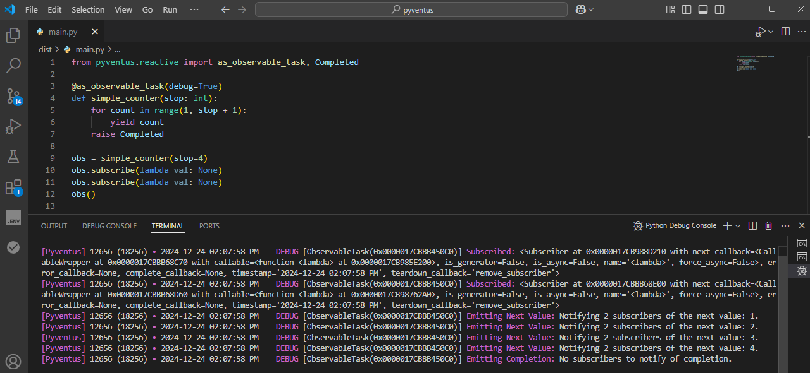

# Event Emitter

<p style='text-align: justify;' markdown>
	&emsp;&emsp;In the previous tutorial, we learned how to link events with their event handlers using the 
	`EventLinker`. Now, let's dive into the process of dispatching events and triggering the associated callbacks.
	This tutorial will introduce you to the `EventEmitter` class, which plays a crucial role in this event-driven
	system.
</p>

## What is the EventEmitter?

<p style='text-align: justify;' markdown>
	&emsp;&emsp;The `EventEmitter` is an abstract base class that provides a common interface for emitting events and
	notifying registered callbacks when those events occur. It serves as the foundation for implementing custom event
	emitters with specific dispatch strategies.
</p>

## The Purpose of EventEmitter

<p style='text-align: justify;' markdown>
	&emsp;&emsp;The main goal of the `EventEmitter` base class is to decouple the event emission from the underlying
	implementation responsible for handling the event callbacks. This decoupling promotes flexibility, adaptability,
	and adheres to the [Open-Closed principle](https://www.cs.utexas.edu/users/downing/papers/OCP-1996.pdf),
	allowing the implementation of custom event emitters without impacting existing consumers.
</p>

<p style='text-align: justify;' markdown>
	&emsp;&emsp;The `EventEmitter` presents a unified API with two key methods: `emit()` and `_process()`. These methods
	can be used in both synchronous and asynchronous contexts to emit events and handle their emission. The `emit()`
	method is used to invoke an event, while the `_process()` method is an abstract method responsible for 
	processing the execution of the emitted event.
</p>

## Pyventus Event Emitters

<p style='text-align: justify;' markdown>
	&emsp;&emsp;Pyventus includes several build-in event emitters by default. For instance, the `AsyncIOEventEmitter`
	leverages the `AsyncIO` framework to handle the execution of event handler callbacks, while the `RQEventEmitter`
	utilizes Redis Queue pub/sub system with workers to manage event handlers. To explore the available event emitters,
	refer to the [Pyventus documentation](/pyventus/getting-started/#optional-dependencies).
</p>

!!! info "Driving Innovation Through Collaboration"

	<p style='text-align: justify;' markdown>
	    &emsp;&emsp;Pyventus is an open source project that welcomes community involvement. If you wish to
		contribute additional event emitters, improvements, or bug fixes, please check the [Contributing](/pyventus/contributing)
		section for guidelines on collaborating. Together, we can further the possibilities of event-driven development.
	</p>

## Custom Event Emitters

<p style='text-align: justify;' markdown>
	&emsp;&emsp;Pyventus provides a powerful abstraction layer for creating custom event emitters, allowing you to
	tailor their behavior and capabilities to suit your specific needs. In this section, we will guide you through
	the process of creating a custom event emitter specifically designed for the [FastAPI](https://fastapi.tiangolo.com/)
	framework.
</p>

<p style='text-align: justify;' markdown>
	&emsp;&emsp;The objective is to leverage FastAPI's [BackgroundTasks](https://fastapi.tiangolo.com/reference/background/)
	feature to efficiently process event handler callbacks within your FastAPI application. Before we jump into the
	implementation details, make sure you have FastAPI properly [installed](https://fastapi.tiangolo.com/?h=#installation)
	and set up in your development environment.
</p>

### Defining and Implementing the Custom Event Emitter Class

<p style='text-align: justify;' markdown>
	&emsp;&emsp;To create the custom event emitter for FastAPI, we'll define a class called `FastAPIEventEmitter`. This
	class will extend the base `EventEmitter` class and implement the abstract `_process()` method using the
	FastAPI's background tasks to handle the event emission properly.
</p>

```Python linenums="1" hl_lines="5 10 13"
from fastapi import BackgroundTasks
from pyventus import EventEmitter


class FastAPIEventEmitter(EventEmitter):
    """Custom event emitter class that leverages the FastAPI's asynchronous workflow."""

    def __init__(self, background_tasks: BackgroundTasks):
        super().__init__()
        self._background_tasks = background_tasks  # (1)!

    def _process(self, event_emission: EventEmitter.EventEmission) -> None:
        self._background_tasks.add_task(event_emission)  # (2)!
```

1. Stores the FastAPI background tasks object.
2. Executes the event handler callbacks as background tasks.

<p style='text-align: justify;' markdown>
	Once the custom event emitter is defined, you can integrate it into your code as follows:
</p>

```Python linenums="16" hl_lines="1 10 11 17 18"
@EventLinker.on('console_print')
async def console_print(message: str):
    await sleep(randint(0, 3))  # (1)!
    print(message)


app = FastAPI()


@app.get("/print")
async def console_print_endpoint(background_tasks: BackgroundTasks):
    """ FastAPI endpoint that triggers the console_print event. """

    def console_print_app_service(event_emitter: EventEmitter) -> None:
        event_emitter.emit('console_print', message=f"\nHello, {event_emitter.__class__.__name__}!")

    fastapi_event_emitter = FastAPIEventEmitter(background_tasks)
    console_print_app_service(event_emitter=fastapi_event_emitter)

    return {"message": "Console print triggered!"}
```

1. Simulate a random delay.

??? example "To test the custom event emitter integration follow these steps..."

	<p style='text-align: justify;' markdown>
		[Run the server](https://fastapi.tiangolo.com/#run-it) with:
	</p>
	
	```console
	uvicorn main:app --reload
	```
	
	<p style='text-align: justify;' markdown>
		Open your browser at [http://127.0.0.1:8000/print](http://127.0.0.1:8000/print). You will see the JSON
		response as:
	</p>
	
	```JSON
	{ "message": "Console print triggered!" }
	```
	<p style='text-align: justify;' markdown>
		And also you are going see the outputs of the event emitter in the console logs as:
	</p>
	
	```console
	INFO:     Uvicorn running on http://127.0.0.1:8000 (Press CTRL+C to quit)
	INFO:     Started reloader process [28720]
	INFO:     Started server process [28722]
	INFO:     Waiting for application startup.
	INFO:     Application startup complete.
	INFO:     127.0.0.1:52391 - "GET /print HTTP/1.1" 200 OK
	
	Hello, FastAPIEventEmitter!
	```

!!! tip "Official `FastAPIEventEmitter` Integration"
	No need for manual implementation! Pyventus now offers an official [**FastAPIEventEmitter**](/pyventus/tutorials/emitters/fastapi)
	integration.

## Runtime Flexibility

<p style='text-align: justify;' markdown>
	&emsp;&emsp;Another key feature of the Pyventus `EventEmitter` is the decoupling of event dispatching from the
	underlying implementation that processes the event handlers. This, combined with the `EventLinker`, allows
	you to change the event emitter at runtime without reconfiguring all the connections or any complex logic. We can
	use the base `EventEmitter` as a `dependency` and then change the concrete instance to suit your needs. Let's
	demonstrate this using the `AsyncIOEventEmitter` and `ExecutorEventEmitter`:
</p>

```Python title="Example of Event Emitters that are Changed at Runtime" linenums="1" hl_lines="4 9 13-16"
from pyventus import EventLinker, EventEmitter, AsyncIOEventEmitter, ExecutorEventEmitter


@EventLinker.on("StringEvent")
def event_callback(msg: str):
    print(msg)


def send_notification(event_emitter: EventEmitter) -> None:
    event_emitter.emit("StringEvent", msg=f"Notifying with {event_emitter.__class__.__name__}!")


send_notification(AsyncIOEventEmitter())

with ExecutorEventEmitter() as executor_emitter:
    send_notification(executor_emitter)
```

<p style='text-align: justify;' markdown>
	&emsp;&emsp;In the example above, we defined a helper function `send_notification` that accepts an `EventEmitter`
	instance as a parameter. This allows us to dynamically switch between the `AsyncIOEventEmitter` and the
	`ExecutorEventEmitter` depending on our requirements. This flexibility enables us to adapt the event
	emitter implementation at runtime without modifying the core application logic.
</p>

## Using Custom Event Linkers

<p style='text-align: justify;' markdown>
	&emsp;&emsp;The base `EventEmitter` allows you to specify the `EventLinker` class that will be used by the `EventEmitter`.
	To configure this option, you can set manually the `EventLinker` class in the constructor.
</p>

```Python title="Using a Custom EventLinker Class" linenums="1" hl_lines="4 13 18"
from src.pyventus import EventEmitter, EventLinker, AsyncIOEventEmitter, Event


class CustomEventLinker(EventLinker, max_event_handlers=10):
    pass


@EventLinker.on(Event)
def event_logger(*args, **kwargs):
    print("Event received!", args, kwargs)


@CustomEventLinker.once("Hello")
def event_callback(name: str):
    print(f"Hello, {name}!")


event_emitter: EventEmitter = AsyncIOEventEmitter(event_linker=CustomEventLinker)

event_emitter.emit('Hello', "Pyventus")
```

<p style='text-align: justify;' markdown>
	&emsp;&emsp;In the example above, we have set the custom event linker to the concrete class of the `EventEmitter`.
	When we emit the "Hello" event, we can see that only the `event_callback()`, which was registered within
	the `CustomEventLinker` namespace, gets triggered and removed. The `event_logger()` callback, registered
	in a different `EventLinker` context, does not get triggered.
</p>

## Debug Mode

<p style='text-align: justify;' markdown>
	&emsp;&emsp;Pyventus' `EventEmitter` offers a useful debug mode feature to help you understand the flow of events
	and troubleshoot your event-driven application. You can enable debug mode in the `EventEmitter` using the following
	options:
</p>

### Global Debug Mode

<p style='text-align: justify;' markdown>
	&emsp;&emsp;By default, Pyventus makes use of Python's global debug tracing feature. To activate the global debug
	mode, simply run your code in an IDE's debugger mode. This allows you to observe the execution of events and trace
	their paths.
</p>

<p align="center">
   
</p>

### Instance Debug Flag

<p style='text-align: justify;' markdown>
    &emsp;&emsp;Alternatively, if you want to enable or disable debug mode for a specific `EventEmitter` instance, you
	can use the `debug` flag provided by the concrete implementation. Setting the `debug` flag to `True` enables
	debug mode for that instance, while setting it to `False` disables debug mode. Here's an example:
</p>

=== "Debug flag `On`"

	```Python title="Using the Custom FastAPIEventEmitter" linenums="1" hl_lines="10"
	from pyventus import EventEmitter, EventLinker, AsyncIOEventEmitter
	
	
	@EventLinker.on('Hello')
	def event_callback(name: str):
	    print(f"Hello, {name}!")
	
	
	# Enable debug mode for a specific EventEmitter instance
	event_emitter: EventEmitter = AsyncIOEventEmitter(debug=True)
	
	event_emitter.emit('Hello', 'Pyventus')
	```

=== "Debug flag `Off`"

	```Python title="Using the Custom FastAPIEventEmitter" linenums="1" hl_lines="10"
	from pyventus import EventEmitter, EventLinker, AsyncIOEventEmitter
	
	
	@EventLinker.on('Hello')
	def event_callback(name: str):
	    print(f"Hello, {name}!")
	
	
	# Disable debug mode for a specific EventEmitter instance
	event_emitter: EventEmitter = AsyncIOEventEmitter(debug=False)
	
	event_emitter.emit('Hello', 'Pyventus')
	```

## Best Practices

<p style='text-align: justify;' markdown>
	&emsp;&emsp;To fully leverage the power of the `EventEmitter`, it is recommended to **use the base** `EventEmitter` **as a
	dependency** instead of any concrete implementation. This allows you to easily switch between different event
	emitter implementations at runtime, providing flexibility and adaptability to your code.
</p>

## Recap

<p style='text-align: justify;' markdown>
	&emsp;&emsp;In this tutorial, we learned about the `EventEmitter` component and its role in dispatching events and
	triggering associated callbacks. We explored the base `EventEmitter` class, its unified async/sync API, and
	the process of creating custom event emitters. We also covered the usage of custom event linkers, best
	practices for using the `EventEmitter`, and the debug mode options provided by Pyventus.
</p>

<br>
