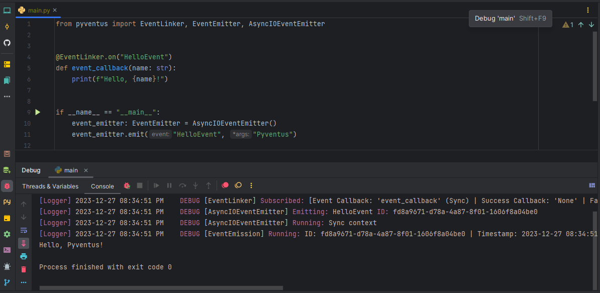

<p style='text-align: justify;' markdown>
    &emsp;&emsp;Events are essential for building reactive applications with Pyventus. However, we need a way to connect
	events to the code that should run in response. This is where the `EventLinker` comes in.
</p>

## What is the EventLinker?

<p style='text-align: justify;' markdown>
    &emsp;&emsp;The `EventLinker` is a central class that acts as a registry for linking events to their associated 
	event handlers. It keeps track of which events have event handlers assigned to them, so when an event occurs it knows
	which code needs to run.
</p>

<p style='text-align: justify;' markdown>
    &emsp;&emsp;The `EventLinker` can also be subclassed to create separate linking registries, allowing you to define
	different namespaces or contexts for events and event handlers. 
</p>

## Benefits of Using The EventLinker

<p style='text-align: justify;' markdown>
	Using the `EventLinker` class offers several advantages:
</p>

<ul style='text-align: justify;' markdown>

<li markdown>**Clear separation of concerns** - 
The emitter class focuses only on emitting events, while the linker handles all the subscription logic. This makes
both classes cleaner and easier to understand, as well as allowing them to be modified independently as needed.
</li>

<li markdown>**Centralized logic** - 
Having global registries means there is only one place to go to see which events have event handlers. This simplifies
management of the overall event system.
</li>

<li markdown>**Flexibility** - 
You can change the event emitter instance at runtime without the need to reconfigure all connections.
</li>

</ul>

## Subscribing Event Handlers

<p style='text-align: justify;' markdown>
    &emsp;&emsp;The `EventLinker` makes it easy to subscribe event handlers to respond to events. Let's explore the
	different approaches to subscribing event handlers.
</p>

### Subscription Basics

<p style='text-align: justify;' markdown>
    &emsp;&emsp;Pyventus supports two types of subscriptions to handle callback registration: regular subscriptions and
	one-time subscriptions. Each subscription, regardless of type, will create a separate `EventHandler` instance
	independently. So subscribing the same callback multiple times to an event will cause it to be invoked
	multiple times. 
</p>

### Regular Subscriptions

<p style='text-align: justify;' markdown>
	&emsp;&emsp;Regular subscriptions trigger the event handler each time the subscribed event(s) occur, and the
	handler remains subscribed until explicitly unsubscribed. Below we will explore how to subscribe regular
	event handlers.
</p>

#### Using decorators

<p style='text-align: justify;' markdown>
    Decorators provide a clean Python syntax for subscribing handlers.
</p>

=== "`Sync` context"

	```Python linenums="1" hl_lines="5 11"
	from pyventus import EventLinker, Event
	
	
	# Subscribe to one event
	@EventLinker.on('StringEvent')
	def event_callback1():
	    print("Event received!")
	
	
	# Subscribe to multiple events at once
	@EventLinker.on('StringEvent', ValueError, Event)
	def event_callback2():
	    print("Event received!")
	```

=== "`Async` context"

	```Python linenums="1" hl_lines="5 6 11 12"
	from pyventus import EventLinker, Event
	
	
	# Subscribe to one event
	@EventLinker.on('StringEvent')
	async def event_callback1():
	    print("Event received!")
	
	
	# Subscribe to multiple events at once
	@EventLinker.on('StringEvent', ValueError, Event)
	async def event_callback2():
	    print("Event received!")
	```

#### Using the subscribe() method

<p style='text-align: justify;' markdown>
    You can also subscribe event handlers by calling the `subscribe()` method.
</p>

=== "`Sync` context"

	```Python linenums="1" hl_lines="9 12"
	from pyventus import EventLinker, Event
	
	
	def event_callback():
	    print("Event received!")
	
	
	# Subscribe to one event
	EventLinker.subscribe('StringEvent', event_callback=event_callback)
	
	# Subscribe to multiple events at once
	EventLinker.subscribe('StringEvent', ValueError, Event, event_callback=event_callback)
	```

=== "`Async` context"

	```Python linenums="1" hl_lines="4 9 12"
	from pyventus import EventLinker, Event
	
	
	async def event_callback():
	    print("Event received!")
	
	
	# Subscribe to one event
	EventLinker.subscribe('StringEvent', event_callback=event_callback)
	
	# Subscribe to multiple events at once
	EventLinker.subscribe('StringEvent', ValueError, Event, event_callback=event_callback)
	```

### One-time Subscriptions

<p style='text-align: justify;' markdown>
	&emsp;&emsp;One-time subscriptions trigger the event handler only once, then automatically unsubscribe it.
	One-time handlers are useful for tasks that should only run once.
</p>

!!! info "Behavior with Multiple Events"

	<p style='text-align: justify;' markdown>
	    When subscribing a one-time handler to multiple events, if one event fires it will automatically unsubscribe
		the event handler from all other events.
	</p>

#### Using decorators

<p style='text-align: justify;' markdown>
    In order to perform a one-time subscription using decorators we use the `once()` method:
</p>

=== "`Sync` context"

	```Python linenums="1" hl_lines="5 11"
	from pyventus import EventLinker, Event
	
	
	# Subscribe to one event
	@EventLinker.once('StringEvent')
	def one_time_event_callback1():
	    print("Event received!")
	
	
	# Subscribe to multiple events at once
	@EventLinker.once('StringEvent', ValueError, Event)
	def one_time_event_callback2():
	    print("Event received!")
	```

=== "`Async` context"

	```Python linenums="1" hl_lines="5 6 11 12"
	from pyventus import EventLinker, Event
	
	
	# Subscribe to one event
	@EventLinker.once('StringEvent')
	async def one_time_event_callback1():
	    print("Event received!")
	
	
	# Subscribe to multiple events at once
	@EventLinker.once('StringEvent', ValueError, Event)
	async def one_time_event_callback2():
	    print("Event received!")
	```

#### Using the subscribe() method

<p style='text-align: justify;' markdown>
    Alternatively, you can also use the `subscribe()` method to do a one-time subscription too:
</p>

=== "`Sync` context"

	```Python linenums="1" hl_lines="9 12"
	from pyventus import EventLinker, Event
	
	
	def one_time_event_handler():
	    print("Event received!")
	
	
	# Subscribe to one event
	EventLinker.subscribe('StringEvent', event_callback=one_time_event_handler, once=True)
	
	# Subscribe to multiple events at once
	EventLinker.subscribe('StringEvent', ValueError, Event, event_callback=one_time_event_handler, once=True)
	```

=== "`Async` context"

	```Python linenums="1" hl_lines="4 9 12"
	from pyventus import EventLinker, Event
	
	
	async def one_time_event_handler():
	    print("Event received!")
	
	
	# Subscribe to one event
	EventLinker.subscribe('StringEvent', event_callback=one_time_event_handler, once=True)
	
	# Subscribe to multiple events at once
	EventLinker.subscribe('StringEvent', ValueError, Event, event_callback=one_time_event_handler, once=True)
	```

### Defining Event Response Logic

<p style='text-align: justify;' markdown>
    &emsp;&emsp;In the previous sections, we discussed the process of subscribing callback functions to handle events 
	using Pyventus' event linker. However, there may be times when we need more control over the exact workflow.
</p>

<p style='text-align: justify;' markdown>
    &emsp;&emsp;In this section, we'll show you how to define custom logic to process events upon completion using
	success and failure handlers. It's important to have reliable control over the asynchronous flow to build robust
	apps.
</p>

#### Response Logic For Regular Subscriptions

=== "Using Decorators"

	```Python linenums="1"  hl_lines="3 5-6 10-11 14-15"
	from pyventus import EventLinker
	
	with EventLinker.on("StringEvent") as linker: # (1)!
		
	    @linker.on_event
	    def event_callback() -> str:
	        print("Event received!")
	        return "Event succeeded!"
	
	    @linker.on_success
	    async def success_callback(msg: str) -> None:
	        print(msg)
	
	    @linker.on_failure
	    def failure_callback(exc: Exception) -> None:
	        print(exc) 
	```
	
	1. When the `EventLinker.on` method is used as a context manager via the `with` statement, it allows multiple
	   callbacks to be associated with events within the `linkage context block`, defining the event workflow.

=== "Using the `subscribe()` method"

	```Python linenums="1"  hl_lines="3 7 10 15"
	from pyventus import EventLinker
	
	def event_callback() -> str:
	    print("Event received!")
	    return "Event succeeded!"
	
	async def success_callback(msg: str) -> None:
	    print(msg)
	
	def failure_callback(exc: Exception) -> None:
	    print(exc)
	

	EventLinker.subscribe(
	    "StringEvent", event_callback=event_callback, success_callback=success_callback, failure_callback=failure_callback,
	)
	
	```

#### Response Logic For One-time Subscriptions

=== "Using Decorators"

	```Python linenums="1"  hl_lines="3 5-6 10-11 14-15"
	from pyventus import EventLinker

	with EventLinker.once("StringEvent") as linker: # (1)!

	    @linker.on_event
	    async def event_callback() -> str:
	        print("Event received!")
	        return "Event succeeded!"

	    @linker.on_success
	    def success_callback(msg: str) -> None:
	        print(msg)

	    @linker.on_failure
	    async def failure_callback(exc: Exception) -> None:
	        print(exc)
	```
	
	1. When the `EventLinker.once` method is used as a context manager via the `with` statement, it allows multiple
	   callbacks to be associated with events within the `linkage context block`, defining the event workflow.

=== "Using the `subscribe()` method"

	```Python linenums="1"  hl_lines="3 7 10 14-15"
	from pyventus import EventLinker
	
	async def event_callback() -> str:
	    print("Event received!")
	    return "Event succeeded!"
	
	def success_callback(msg: str) -> None:
	    print(msg)
	
	async def failure_callback(exc: Exception) -> None:
	    print(exc)

	EventLinker.subscribe(
	    "StringEvent", event_callback=event_callback, success_callback=success_callback, failure_callback=failure_callback,
		once=True,
	)
	
	```

## Unsubscribing Event Handlers

<p style='text-align: justify;' markdown>
    &emsp;&emsp;Removing event handlers is an important part of working with events. Let's look at different approaches
	to properly teardown event subscriptions:
</p>

### Removing a Event Handler from an Event

<p style='text-align: justify;' markdown>
	To remove a single event handler from a specific event:
</p>

```Python linenums="1" hl_lines="10"
from pyventus import EventLinker, Event


def event_callback():
    print("Event received!")


event_handler = EventLinker.subscribe('StringEvent', Event, event_callback=event_callback)

EventLinker.unsubscribe('StringEvent', event_handler=event_handler)
```

### Removing Event Handlers from All Events

<p style='text-align: justify;' markdown>
	To remove an event handler from all subscribed events:
</p>

```Python linenums="1" hl_lines="10"
from pyventus import EventLinker, Event


def event_callback():
    print("Event received!")


event_handler = EventLinker.subscribe('StringEvent', Event, event_callback=event_callback)

EventLinker.remove_event_handler(event_handler=event_handler)  # (1)!
```

1. Removes the `event_handler` from the `Event` and `StringEvent`

### Removing an Event and its Event Handlers

<p style='text-align: justify;' markdown>
	To delete an event and all associated handlers:
</p>

```Python linenums="1" hl_lines="14"
from pyventus import EventLinker, Event


@EventLinker.on('StringEvent')
def event_callback1():
    print("Event received!")


@EventLinker.on('StringEvent', Event)
def event_callback2():
    print("Event received!")


EventLinker.remove_event(event='StringEvent')  # (1)!
```

1. Removes all event handlers associated with the `StringEvent` event.

### Clearing All Events

<p style='text-align: justify;' markdown>
	To remove all events and their handlers:
</p>

```Python linenums="1" hl_lines="14"
from pyventus import EventLinker, Event


@EventLinker.on('StringEvent', Event)
def event_callback1():
    pass


@EventLinker.on(Event)
def event_callback2():
    pass


EventLinker.remove_all() 
```

## Custom Event Linkers

<p style='text-align: justify;' markdown>
	&emsp;&emsp;The `EventLinker` class in Pyventus was designed to support subclassing to allow you to define separate
	*linking registries* or *namespaces* for your events and handlers, as well as configure the `EventLinker` behavior.
	This approach provides a powerful way to customize how events are linked within your applications. Some key reasons
	for using custom linkers include:
</p>

<ul style='text-align: justify;' markdown>

<li markdown>
Organizing events into logical domains/contexts.
</li>

<li markdown>
Isolating events to only be accessible within certain scopes.
</li>

<li markdown>
Configuring linker-specific options like max handlers per event.
</li>

</ul>

<p style='text-align: justify;' markdown>
	To define a custom linker, subclass the `EventLinker`, as shown below:
</p>

```Python linenums="1" hl_lines="4 9 14"
from pyventus import EventLinker


class UserEventLinker(EventLinker, max_event_handlers=10):
    """ EventLinker for User's events only """
    pass  # Additional logic can be added here if needed...


@UserEventLinker.on('OnPasswordReset')
async def on_password_reset_callback(email: str):
    print("OnPasswordReset received!")


@UserEventLinker.on('OnEmailVerified')
async def on_email_verified_callback(email: str):
    print("OnEmailVerified received!")
```

## Debug Mode

<p style='text-align: justify;' markdown>
	&emsp;&emsp;The `EventLinker` also offers a debug mode feature which helps you understand how event subscriptions
	and unsubscriptions are happening during runtime.
</p>

### Global Debug Mode

<p style='text-align: justify;' markdown>
	&emsp;&emsp;By default, Pyventus leverages the Python's global debug tracing feature. Simply run your code in an
	IDE's debugger mode to activate the global debug mode tracing.
</p>

<p align="center">
   
</p>

### Namespace Debug Flag

<p style='text-align: justify;' markdown>
    &emsp;&emsp;Alternatively, if you want to enable or disable the debug mode specifically for a certain `EventLinker` 
	namespace, you can use the `debug` flag that is available in the subclass configurations. Setting the
	`debug` flag to `True` enables debug mode for that namespace, while setting it to `False` disables
	debug mode. Here's an example:
</p>

=== "Debug Flag `On`"

	```Python linenums="1" hl_lines="4"
	from pyventus import EventLinker
	
	
	class CustomEventLinker(EventLinker, debug=True):
	    pass  # Additional logic can be added here if needed...
	
	
	@CustomEventLinker.on('StringEvent')
	def event_callback():
	    print("Event received!")
	```

=== "Debug Flag `Off`"

	```Python linenums="1" hl_lines="4"
	from pyventus import EventLinker
	
	
	class CustomEventLinker(EventLinker, debug=False):
	    pass  # Additional logic can be added here if needed...
	
	
	@CustomEventLinker.on('StringEvent')
	def event_callback():
	    print("Event received!")
	```

## Recap

<p style='text-align: justify;' markdown>
	In this tutorial we covered:
</p>


<ul style='text-align: justify;' markdown>

<li markdown>
Subscribing regular and one-time handlers with decorators and the `subscribe()` method.
</li>

<li markdown>
Unsubscribing a single event handler, all handlers, an event, or clearing all.
</li>

<li markdown>
Custom EventLinkers to separate event namespaces.
</li>

<li markdown>
Debug mode to trace subscriptions
</li>

</ul>

<p style='text-align: justify;' markdown>
	We learned the core `EventLinker` concepts of:
</p>


<ul style='text-align: justify;' markdown>

<li markdown>
Use the EventLinker to link events to code responses.
</li>

<li markdown>
Subscribe/unsubscribe as needed using various approaches.
</li>

</ul>

<br>
